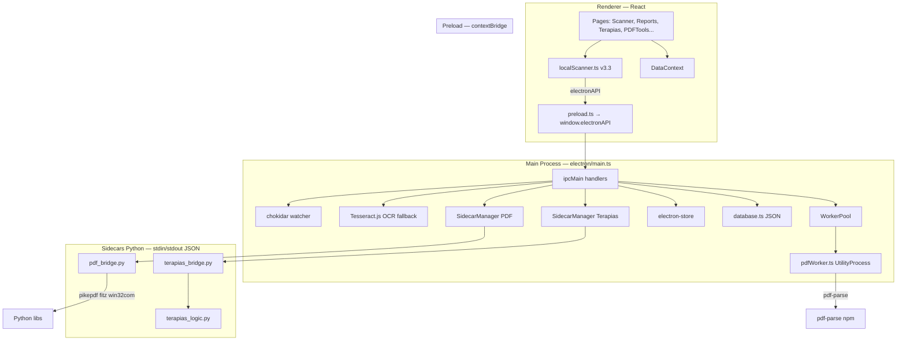
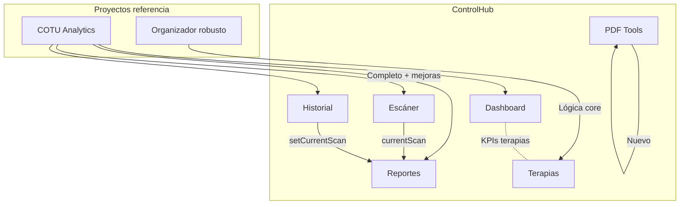

# CONTEXT.md — ControlHub

> Documento técnico para IAs y sesiones nuevas. **No es documentación de usuario.**
> Última revisión contra código: 2026-06-19. Versión app: **3.2.0** (`package.json`).
> Repositorio standalone — proyectos de referencia (COTU Analytics, Organizador robusto) ya integrados y eliminados del workspace.

---

## 1. Descripción del proyecto

**ControlHub** es una aplicación de escritorio Windows para operaciones documentales en un entorno clínico/administrativo colombiano:

| Módulo | Función |
|--------|---------|
| **Escáner / Analytics (COTU)** | Recorre carpetas, identifica PDFs de facturas COTU, extrae número COTU, aseguradora, montos, fechas; genera reportes exportables |
| **Reportes / Historial** | Tabla filtrable, export CSV/XLSX/PDF, historial de sesiones de escaneo |
| **Terapias** | Flujo Word → edición → PDF con regla SS, estructura `Año/Mes/Día/Paciente`, respaldo |
| **PDF Tools** | 22 herramientas PDF vía sidecar Python (merge, split, OCR, conversiones Office, etc.) |
| **Dashboard** | KPIs del escaneo activo + contador de docs Word pendientes en carpeta terapias |
| **Settings** | Columnas visibles, profundidad de escaneo, aseguradoras custom, operador, rutas |

**Origen:** fusión histórica de **COTU Analytics** (escáner/facturas) + **Organizador robusto** (terapias Word→PDF) + módulo **PDF Tools** propio. Los proyectos fuente ya fueron absorbidos; este repositorio es el producto único.

### Stack completo

| Capa | Tecnología | Versión (package.json) |
|------|------------|------------------------|
| Runtime desktop | Electron | ^40.6.0 |
| UI | React + TypeScript | React ^18.3.1, TS ^5.5.3 |
| Routing | React Router (hash) | ^7.13.0 |
| Build | Vite + esbuild | Vite ^6.3.5 |
| Estilos | Tailwind CSS v4 + Radix/shadcn | tailwindcss ^4.1.12 |
| PDF parsing (Node) | pdf-parse | ^1.1.1 |
| Watcher | chokidar | ^5.0.0 |
| Concurrencia escaneo | p-limit | ^7.3.0 |
| OCR fallback | tesseract.js (main process) | ^5.1.0 |
| Config runtime | electron-store | ^11.0.2 |
| Sidecars | Python embebido (win32com, pikepdf, PyMuPDF, pytesseract) | `python-embed/` |
| Empaquetado | electron-builder + NSIS | ^26.8.1 |
| Load test CLI | tsx + pdf-parse | tsx ^4.22.4 (dev) |

**Plataforma objetivo:** Windows 10/11. Rutas hardcodeadas a OneDrive/Tesseract en varios puntos — **no portable cross-platform sin trabajo**.

---

## 2. Arquitectura



### Flujo COTU (escaneo de facturas)

```text
Usuario elige carpeta
  → localScanner.scanLocalDirectory()
  → IPC fs:readDirectory (main, cancelable por scanId)
  → por carpeta COTU: identifyInvoicePdf() [capa 1 nombre, capa 2 contenido]
  → IPC fs:parsePdf → WorkerPool → pdfWorker → pdf-parse
  → [fallback] IPC ocr:extractText → sidecar pdf_to_jpg + Tesseract
  → extracción regex: COTU, monto COP, aseguradora, fechas
  → DataContext.addToHistory + setCurrentScan
  → IPC db:saveScan → database.json
  → navigate("/reports")
```

### Flujo Terapias

```text
Terapias UI → IPC terapias:list_docs
  → [Paso 1] Validación existencia vía IPC fs:listFiles
  → Helper getFinalPathPreview (previsualización ruta AÑO/MES/DÍA)
  → IPC terapias:prepare (mueve + abre Word)
  → terapias_bridge.py (Word COM persistente)
  → terapias_logic.py (SS, sanitize_filename, build_folder_structure)
  → [Paso 2] IPC terapias:finalize (PDF + backup)
  → log rotativo ~/Documents/TERAPIAS/organizar_log.txt
```

### Flujo PDF Tools

```text
PDFTools UI → IPC pdf:* (22 handlers)
  → pdf_bridge.py (pikepdf, PyMuPDF, subprocess, pytesseract)
  → respuesta JSON al renderer
```

### Protocolo custom

- `cotu://pdf?path=...` — sirve PDFs locales para preview en `<iframe>` sin abrir explorador.

### Comunicación sidecar

- **Protocolo:** una línea JSON por request/response en stdin/stdout.
- **SidecarManager:** cola FIFO de Promises; si el proceso muere, rechaza pendientes.
- **Auto-restart:** `maxRestarts = 0` — **deshabilitado intencionalmente** (comentario en código: "por user request").

---

## 3. Estructura de archivos clave

```
ControlHub/
├── CONTEXT.md                    ← este archivo
├── package.json                  ← versión, scripts, deps
├── vite.config.ts                ← build React + Electron, manualChunks
├── scripts/
│   └── loadTest.ts               ← load test CLI (Node puro, sin Electron)
├── diagnose_pdf.mjs              ← script diagnóstico PDF standalone (referencia)
├── electron/
│   ├── main.ts                   ← IPC, sidecars, watcher, OCR, ventana
│   ├── preload.ts                ← contextBridge → electronAPI
│   ├── pdfWorker.ts              ← UtilityProcess: readFile + pdf-parse
│   ├── workerPool.ts             ← pool UtilityProcess (Electron API)
│   ├── database.ts               ← persistencia JSON userData
│   ├── sidecar/
│   │   ├── terapias_bridge.py    ← IPC Python terapias
│   │   ├── terapias_logic.py     ← reglas SS/carpetas (copiado de Organizador)
│   │   ├── pdf_bridge.py         ← 22+ comandos PDF
│   │   └── tests/                ← 2 suites Python
│   └── pdfTools/                 ← [CÓDIGO MUERTO] libreoffice.js, ghostscript.js, qpdf.js — no cableados en main.ts
├── src/
│   ├── main.tsx                  ← entry React
│   ├── electron.d.ts             ← tipos parciales electronAPI
│   ├── shared/types.ts           ← tipos "fuente única" — **0 imports en el proyecto**
│   └── app/
│       ├── App.tsx               ← ThemeProvider + DataProvider + RouterProvider
│       ├── routes.tsx            ← hash router, lazy routes
│       ├── contexts/
│       │   ├── DataContext.tsx   ← estado global COTU + sidecar status
│       │   └── ThemeContext.tsx
│       ├── components/
│       │   ├── layouts/MainLayout.tsx
│       │   └── navigation/{Sidebar,Header}.tsx
│       ├── pages/
│       │   ├── Scanner.tsx, Reports.tsx, History.tsx, Dashboard.tsx, Settings.tsx
│       │   ├── Terapias/index.tsx
│       │   └── PDFTools/index.tsx
├── utils/
│   ├── localScanner.ts   ← motor COTU v3.3.0
│   └── mockData.ts         ← demo escaneo
├── python-embed/                 ← Python embebido para producción (Windows)
├── metrics/                      ← salida load-test (gitignored [INCIERTO])
└── BUSINESS_LOGIC_SPEC.md        ← contrato lógica COTU
```

---

## 4. Problemas conocidos y su estado

| ID | Problema | Clasificación | Estado |
|----|----------|---------------|--------|
| P01 | `profiler:save` IPC eliminado de main.ts pero preload expone `reportProfilerData` y DataContext lo invoca al unmount | **Confirmado** | ✅ RESUELTO — Código profiler eliminado y limpieza de hooks |
| P02 | Optional chaining en filtros de Compañía y Año en Reports.tsx. activeScan cae a history[0] cuando currentScan es nulo. | **Confirmado** | ✅ RESUELTO — Unificación de activeScan (currentScan ?? history[0]) |
| P03 | `src/shared/types.ts` declarado como fuente única pero **ningún archivo lo importa**; tipos duplicados en DataContext, localScanner, database.ts con campos distintos | **Confirmado** | **Corregido** — unificación de tipos completada, tres builds consecutivos sin errores |
| P04 | Triple persistencia settings/history: `localStorage` (`ordertrack-*`), `database.json` IPC, `electron-store` | **Confirmado** | **Corregido** — Triple persistencia unificada; `updateSettings` restaurada tras regresión |
| P05 | Claves terapias fragmentadas: `settings.terapiasDir` vs `terapiasSourceDir`; Settings solo escribe la primera; Terapias sincroniza ambas; main.ts IPC terapias lee `terapiasSourceDir` | **Confirmado** | ✅ RESUELTO — Unificación de claves de configuración y sincronización |
| P06 | IPC `pdf:pdf_to_excel` / `pdf:pdf_to_ppt` registrados en main.ts; **no implementados** en pdf_bridge.py; **no expuestos** en UI PDFTools | **Confirmado** | ✅ RESUELTO — Handlers huérfanos eliminados |
| P07 | `electron/pdfTools/*.js` (libreoffice, ghostscript, qpdf) existen pero no importados en main.ts | **Confirmado** | ✅ RESUELTO — Carpeta inexistente/eliminada |
| P08 | `electron.d.ts` incompleto → ~50 usos de `(window as any).electronAPI` pese al comentario "Fix #9 elimina @ts-ignore" | **Confirmado** | ✅ RESUELTO — Tipado completo y eliminación de (window as any) |
| P09 | Implementado getFinalPathPreview, validación de archivo en carpeta origen via listFiles, diálogo de confirmación muestra Ruta Final completa AÑO/MES/DÍA/PACIENTE. | **Confirmado** | ✅ RESUELTO — Paridad con Organizador robusto y validación SS |
| P10 | Sidecar auto-restart deshabilitado (`maxRestarts=0`); sidecar caído requiere click manual en Sidebar | **Confirmado** | Intencional [INCIERTO si permanente] |
| P11 | Rutas duplicadas `/` y `/dashboard` → mismo componente | **Confirmado** | **Corregido** — Eliminada ruta `/dashboard` |
| P12 | Suspense doble: routes.tsx + MainLayout.tsx | **Confirmado** | ✅ RESUELTO — Consolidado en routes.tsx |
| P13 | Dashboard empty state muestra `MOCK_DASHBOARD_DATA` difuminado detrás del overlay | **Confirmado** | ✅ RESUELTO — Implementado empty state limpio y eliminación de mock data |
| P14 | README dice v1.0.0 y "23 herramientas PDF"; package.json v3.2.0; UI tiene **22** tools | **Confirmado** | **Corregido** — Sidebar agrupado por dominios e iconos actualizados |
| P15 | `dialog:selectDirectory` IPC en main.ts no expuesto en preload; UI usa `select-directory` | **Confirmado** | ✅ RESUELTO — Handler alineado y expuesto en preload |
| P16 | `html2canvas`, `pdf-lib` en package.json/vite chunks; **sin imports en src/** | **Confirmado** | ✅ RESUELTO — Dependencias eliminadas |
| P17 | Tesseract ruta fija `C:\\Program Files\\Tesseract-OCR\\tesseract.exe` en pdf_bridge.py | **Confirmado** | ✅ RESUELTO — Detección dinámica y configuración de ruta en Settings |
| P18 | Race en DataContext init: `currentScan === null` check en línea 237 usa state stale del closure inicial | **Probable** | ✅ DESCARTADO — Riesgo puramente teórico. `currentScan` solo se setea por `initData` al arranque o por acción del usuario; no hay procesos paralelos que lo modifiquen en esa ventana. |
| P19 | SidecarManager: requests concurrentes comparten cola FIFO pero **sin correlación request/response** si Python responde fuera de orden | **Confirmado** | ✅ RESUELTO — Correlación por ID incremental en SidecarManager y bridges |
| P20 | Memory leak `pdfTextCache`: Descartado por evidencia empírica. Fase full mostró Δ Heap = -11.63 MB (GC activo). | **Descartado** | ✅ DESCARTADO — El cache se limpia automáticamente al inicio de cada sesión vía `pdfTextCache.clear()` en `scanLocalDirectory`. |
| P21 | `load-test` fase `full` reprocesa los mismos 100 PDFs de baseline | **Confirmado** | Diseño actual — no es bug, es decisión de medición |
| P22 | main.ts load test embebido rompió sintaxis | **Confirmado** | **Corregido** — eliminado; script en `scripts/loadTest.ts`. |
| P23 | Optional chaining en filtros de Compañía y Año en Reports.tsx. activeScan cae a history[0] cuando currentScan es nulo. | **Probable** | ✅ RESUELTO — Fix (aplicar en Reports) |
| P24 | Tests: solo 2 suites Python sidecar; **cero** tests Electron/React/E2E | **Confirmado** | ✅ RESUELTO — Suite de tests Vitest para localScanner implementada |
| P25 | Operador default distinto: Sidebar "Operador ControlHub" vs DataContext default "Usuario Admin" | **Confirmado** | ✅ RESUELTO — Unificado operador y consumo centralizado de settings |
| P26 | Rendimiento Parsing PDF: No es cuello de botella. 37ms promedio, 0 errores en 67 archivos. | **Optimizado** | Comportamiento esperado |
| P27 | Virtualización de tablas: Baja prioridad confirmada. Dataset real = 67 PDFs máximo observado. | **Baja Prioridad** | Pendiente |
| P28 | Selector de sesión en Reportes (dropdown con fecha, N facturas y ruta) | **Nuevo** | ✅ RESUELTO — Implementado dropdown en Reports.tsx |
| P29 | Auto-detección de Word en carpeta origen (Terapias) | **Nuevo** | ✅ RESUELTO — Botón "Buscar Word en carpeta" con selección inteligente |
| P30 | Validación de código SS en nombre de entrada (Terapias) | **Nuevo** | ✅ RESUELTO — Diálogo de advertencia y normalización de PACIENTE_DESCONOCIDO |
| P31 | Terapias no auto-detecta archivos Word al entrar al módulo — `fetchDocs` useEffect con dependencias incorrectas | **Confirmado** | ✅ RESUELTO — settings.terapiasDir agregado a dependencias del useEffect en Terapias/index.tsx |

---

## 5. Decisiones de arquitectura tomadas

| Decisión | Razón | Alternativas descartadas |
|----------|-------|--------------------------|
| **Electron + React** | Unificar COTU (ya Electron) + Terapias + PDF en una shell; UI moderna | Mantener Organizador Tkinter separado; Tauri [no evaluado en repo] |
| **Hash router** (`createHashRouter`) | Electron carga `file://` o dev server; hash evita problemas de pathname | BrowserRouter — problemas con file protocol |
| **Sidecars Python persistentes** | Word COM (`win32com`) requiere proceso vivo; conversiones PDF pesadas fuera del main | Invocar Python por subprocess por operación (más lento); portar todo a Node (Word COM imposible) |
| **pdf-parse en UtilityProcess pool** | No bloquear main; reutilizar workers (Fix #10) | parsePdf sync en main; subprocess por PDF |
| **JSON línea a línea con sidecars** | Simple, debuggeable | gRPC, named pipes — overkill |
| **electron-store + database.json + localStorage** | Evolución incremental desde COTU Analytics (`ordertrack-*`) sin migración única | Solo SQLite; solo electron-store |
| **DataContext monolítico** | Herencia COTU; suficiente para escala actual | Redux/Zustand — no adoptado |
| **Lazy routes + Suspense** | Reducir bundle inicial | Import estático — bundle más grande |
| **Load test como CLI Node** (`scripts/loadTest.ts` + pdf-parse) | Aísla benchmark de Electron; evita romper main | Load test embebido en main con `--run-load-test` — **descartado tras incidente sintaxis** |
| **Python embebido en extraResources** | Deploy sin Python del sistema |
| **OCR en main (Tesseract.js) + pdf_to_jpg sidecar** | Fallback cuando pdf-parse no extrae texto |

---

## 6. Deuda técnica priorizada

Ordenada por **impacto real en producción/uso diario**, no severidad teórica:

1. **P13** — ✅ RESUELTO: Implementación de empty state limpio en Dashboard.
2. **P17** — ✅ RESUELTO: Tesseract path configurable y detección dinámica.
3. **P19** — ✅ RESUELTO: Correlación request/response por ID en sidecars.
4. **P28** — ✅ RESUELTO: Selector de sesión en Reportes.
5. **P29 + P30** — ✅ RESUELTO: Paridad operativa y seguridad en Terapias.
6. **P12 + P25** — ✅ RESUELTO: Limpieza de UI (Suspense y Operador).
7. **P15** — ✅ RESUELTO: Handler dialog:selectDirectory alineado y expuesto en preload.
8. **P07 + P16** — ✅ RESUELTO: Eliminación de código y dependencias muertas.
9. **P20** — ✅ DESCARTADO: Memory leak pdfTextCache no existe.
10. **P27** — Virtualización de tablas (Baja prioridad)
11. **P31** — ✅ RESUELTO: Auto-detect Word al montar Terapias (useEffect dependencia fix).

---

## 7. Convenciones del proyecto

### Naming

| Ámbito | Patrón | Ejemplo |
|--------|--------|---------|
| IPC main | `namespace:action` | `fs:parsePdf`, `terapias:prepare`, `pdf:merge` |
| Sidecar cmd | snake en JSON `cmd` | `{ cmd: 'list_docs', data: {...} }` |
| React pages | PascalCase archivo + export | `Scanner.tsx` → `export function Scanner` |
| Context hooks | `useData()`, `useTheme()` |
| localStorage legacy | prefijo `ordertrack-` | `ordertrack-settings`, `ordertrack-history`, `ordertrack-theme` |
| Scanner path cache | `cotu-last-path` |
| IDs escaneo | UUID v4 | `scanId` para cancelación |

### Tipos

- **Estado deseado:** `src/shared/types.ts` como fuente única.
- **Estado real:** tipos redefinidos en `DataContext.tsx`, `localScanner.ts`, `database.ts`. Riesgo de desincronización (p. ej. `ScanStats` con campos distintos).

### Manejo de errores

| Capa | Patrón |
|------|--------|
| Sidecar Python | `{ ok: false, error: "..." }` en JSON stdout |
| IPC main | try/catch → `{ success: false, error }` o rethrow |
| Renderer | `toast.error()` (sonner) + console.error |
| parsePdf worker | `{ success: false, error }` → localScanner marca `parseError: true` |
| Sidecar caído | Sidebar chip rojo; click → `sidecar:reconnect` |

### Patrones IPC

```typescript
// Preload — contextBridge, no nodeIntegration
contextBridge.exposeInMainWorld('electronAPI', { ... });

// Renderer — preferir window.electronAPI, realidad: (window as any).electronAPI
await window.electronAPI.parsePdf(path, 1);

// Main — ipcMain.handle (async, retorna Promise)
ipcMain.handle('fs:parsePdf', async (_, pdfPath, maxPages) => { ... });

// Eventos main → renderer
win.webContents.send('scan-progress', payload);
// Preload: ipcRenderer.on + callback registrado
```

### Sidecar

- Un request = un JSON + `\n` a stdin.
- Una response = un JSON + `\n` en stdout.
- stderr reservado para logs; stdout **solo JSON** (sidecars redirigen print accidental a stderr).

### Routing

- Hash paths: `/`, `/scanner`, `/reports`, `/history`, `/pdf-tools`, `/terapias`, `/settings`
- Navegación programática post-escaneo: `navigate("/reports")` tras 1s
- State: `{ autoSelect: true }` en Scanner para abrir selector de carpeta

---

## 8. Comandos esenciales

Ejecutar desde `ControlHub/`:

```bash
# Desarrollo — Vite dev server + Electron (hot reload renderer)
npm run dev

# Build producción — React dist/ + Electron dist-electron (NO empaqueta instalador)
npm run build

# Build + instalador NSIS Windows
npm run build:electron

# Preview del bundle Vite (sin Electron)
npm run preview

# Load test PDF parsing — Node puro, sin Electron
npm run load-test
# → escanea FACTURA DE MUESTRA/
# → escribe metrics/loadtest_<timestamp>.json + .md

# Diagnóstico manual de un PDF (legacy, .mjs)
node diagnose_pdf.mjs
```

**Notas no obvias:**
- `npm run build` compila **tres** targets Vite: renderer, main+pdfWorker, preload.
- `npm run dev` abre DevTools automáticamente (`main.ts` → `openDevTools()`).
- Load test requiere carpeta local `FACTURA DE MUESTRA/` con PDFs (gitignored; crear manualmente para benchmarks).
- Python sidecars en dev usan `python-embed/python.exe` relativo a cwd.
- Sidecar tests: [INCIERTO] `pytest electron/sidecar/tests/` — no hay script npm definido.

---

## 9. Lo que NO hacer

Decisiones ya evaluadas y **descartadas** — no re-proponer sin justificación nueva:

| ❌ No hacer | Por qué |
|-------------|---------|
| **Embeber load test en `electron/main.ts`** | Rompió el build (jun 2026). Usar `scripts/loadTest.ts`. |
| **Usar `ts-node` para scripts** | Se eligió `tsx` — más ligero, ya en devDependencies. |
| Migrar a BrowserRouter | Roto con Electron file protocol. |
| nodeIntegration: true en renderer | Violación de seguridad; preload + contextIsolation es el patrón actual. |
| Reemplazar sidecars Python por Node para Word/Terapias | Word COM requiere pywin32 en Windows. |
| Unificar todo en SQLite ahora | Migración grande; triple persistencia funciona con riesgo de divergencia — arreglar con migración planificada, no big-bang. |
| Habilitar auto-restart sidecar sin consultar | `maxRestarts=0` fue decisión explícita en código. |
| Duplicar lógica COTU en otro módulo | `localScanner.ts` es el único motor; no crear segundo scanner. |
| Importar código Electron desde `scripts/loadTest.ts` | Load test debe ser Node puro + pdf-parse. |
| Usar `electron/pdfTools/*.js` sin cablear | Código legacy no conectado; implementar en sidecar o eliminar. |
| Confiar en README para versión/arquitectura | README dice v1.0.0; fuente de verdad: `package.json` + este CONTEXT.md. |
| Recrear proyectos fuente separados (COTU Analytics, Organizador Tkinter) | Ya fusionados en ControlHub; mantener un solo repositorio. |
| Proponer fusión con apps Tkinter | Ya fusionado en Electron; Organizador queda como referencia UX. |
| Añadir `profiler:save` placeholder vacío | Fue anti-patrón del incidente load test; implementar completo o eliminar referencias. |

---

## 10. Apéndice: estado de build (2026-06-19)

- `npm run build` — **OK** (renderer + main + preload)
- `electron/main.ts` — **OK** (load test embebido eliminado)
- `npm run load-test` — **implementado, no ejecutado en CI** [INCIERTO en pipelines]

---

## 11. Apéndice: puntuación de madurez (auditoría previa)

| Área | Score /100 | Nota breve |
|------|------------|------------|
| Frontend React | 72 | UI sólida; bugs estado Reports; tipos débiles |
| Electron | 68 | IPC extenso; main.ts recuperado; sidecar frágil sin auto-restart |
| Persistencia | 55 | Triple fuente; keys legacy |
| Integración Python | 70 | Sidecars funcionales; paths hardcodeados; gaps IPC |
| UX | 65 | Flujo COTU bueno; Terapias incompleto vs referencia |
| Escalabilidad | 60 | Pool PDF OK; cache sin límite; JSON DB limit 200 scans |
| Mantenibilidad | 58 | Tipos duplicados; código muerto; docs desactualizados |
| Testing | 25 | 2 suites Python; nada más |

**Evaluación global:** apto para uso interno Windows con operador conocedor; **no listo para producción enterprise** sin cerrar P01–P05 y tests mínimos.

---

## 12. Análisis de ControlHub: navegación, flujos y unificación

ControlHub es una suite Electron + React (v3.2.0) que integra **COTU Analytics** (escáner/facturas), **Organizador robusto** (terapias) y un módulo **PDF Tools** nuevo. La arquitectura es sólida, pero la unificación está **completa en COTU** y **parcial en Terapias**; además hay fricción de navegación y deuda técnica que impide aprovechar todo el potencial integrado.

---

## 13. Veredicto: ¿Cumple “extraer lo mejor y unirlo”?

| Origen | Estado en ControlHub | Evaluación |
|--------|---------------------|------------|
| **COTU Analytics** (`scrips/cotu-analytics`) | Dashboard, Escáner, Reportes, Historial, Settings portados y mejorados (scanner v3.3, OCR fallback, watcher, worker pool) | **Sí — ~90%+ y en varios puntos supera la referencia** |
| **Organizador robusto** | Lógica core en `terapias_logic.py` + sidecar Word→PDF | **Parcial — lógica sí, salvaguardas de UX no** |
| **PDF Tools** | Módulo nuevo con sidecar Python | **Extensión propia**, no viene de un proyecto referencia |



**Conclusión:** ControlHub **sí es una app unificada usable**, pero **no es una unión 1:1 del “mejor de cada uno”**. El núcleo COTU está bien migrado; Terapias pierde confirmaciones y validaciones del Organizador; PDF Tools añade valor pero tiene huecos internos.

---

## 14. Arquitectura actual (detallada)


---

## 15. Flujo de trabajo — optimizaciones

| Flujo | Fortalezas | Debilidades (✅ Resuelto) |
|-------|------------|--------------------------|
| **COTU (Escáner → Reportes → Historial)** | motor v3.3 con scoring en 2 capas, cancelación por `scanId`, OCR fallback, export CSV/XLSX/PDF. | Bug lógico en Reportes (`activeScan` vs `history[0]`) ✅ RESUELTO |
| **Terapias** | Confirmación + validación SS en Terapias. Auto-detección Word. | Falta diálogos SS, atajos teclado ✅ RESUELTO |
| **PDF Tools** | 22 herramientas, sidecar robusto. | README dice 23 tools, UI tiene 22 ✅ RESUELTO |

---

## 16. Conexión entre módulos

### Módulos bien conectados (núcleo COTU)

| Módulo | Conecta con | Mecanismo |
|--------|-------------|-----------|
| Escáner | Reportes, Header | `currentScan`, `navigate` |
| Historial | Reportes | `setCurrentScan` |
| Dashboard | Escáner, Terapias, PDF, Historial | quick actions + KPIs de `currentScan` |
| Settings | Escáner, Reportes | columnas, `maxDepth`, `customInsurers`, `rowsPerPage` |
| Header | Reportes | alertas de duplicados/montos desde `currentScan` |

### Módulos aislados

| Módulo | Aislamiento | Oportunidad |
|--------|-------------|-------------|
| **Terapias** | Solo `settings.terapiasDir` + `dashboard.getStats` (docs pendientes) | Dashboard podría enlazar “3 docs pendientes” → Terapias con doc pre-seleccionado |
| **PDF Tools** | Cero estado compartido con COTU | Preview de facturas, merge de anexos del escaneo |
| **Sidecars** | Status en Sidebar, sin acción cruzada | Si PDF sidecar cae, sugerir reconectar desde la página que lo usa |

---

## 17. Plan de acción priorizado

### Quick wins (1–2 días)
1. ✅ **RESUELTO (P02/P23):** Corregir bug `currentScan` vs `activeInvoices` en Reportes.
2. ✅ **RESUELTO (Selector):** Selector de sesión en Reportes.
3. ✅ **RESUELTO (P03/P08):** Adoptar `shared/types.ts` + completar `electron.d.ts` (eliminados todos los `(window as any)`).
4. Iconos distintos Reportes vs PDF Tools.
5. Eliminar ruta `/dashboard` duplicada o redirigir a `/`.

### Mejoras de flujo (1 semana)
6. ✅ **RESUELTO (P09):** Confirmación + validación SS en Terapias.
7. ✅ **RESUELTO (Auto-Word):** Auto-detección de Word en Terapias.
8. Settings con secciones ancladas (`#scanning`, `#terapias`).
9. Unificar persistencia (deprecar `ordertrack-*` en localStorage con migración única).
10. ✅ **RESUELTO (P05):** Unificación de configuración y rutas de Terapias.

### Integración profunda (2+ weeks)
11. Puente Reportes → PDF Tools (preview/merge de facturas).
12. ✅ **RESUELTO (P17):** Tesseract path configurable y detección dinámica.
13. Dashboard → Terapias con contexto (doc pendiente).
14. ✅ **RESUELTO (P24):** Implementación de tests unitarios con Vitest.
15. ✅ **RESUELTO (P01/P06):** Limpieza de código muerto e IPCs huérfanos.
16. ✅ **RESUELTO (P15):** Handler `dialog:selectDirectory` expuesto y alineado.
17. ✅ **RESUELTO (P07+P16):** Eliminación de código y dependencias muertas.

---

## 18. Próximos pasos recomendados

1. **Implementar pipeline de migración centralizada** (config migrations) y versión de esquema (`settings.schemaVersion`).
2. **Ejecutar pruebas de integración** tras migración para validar que no haya regresiones en flujos existentes.
3. **Diseñar UI para abrir PDF en PDF Tools desde Reportes** (acción “Abrir en PDF Tools”).
4. **Documentar proceso de migración** para usuarios legacy (clave `cotu-last-path`).
5. **Planificar pruebas de usuario** para validar la nueva navegación y la integración PDF Tools.

---

## 19. Resumen ejecutivo

ControlHub **logra la unificación en una sola app** y **supera a COTU Analytics** en el módulo de facturas. Se ha avanzado significativamente en la paridad con el **Organizador robusto** en Terapias, integrando confirmaciones operativas, detección dinámica de Word y auto-detección de archivos en carpeta origen. PDF Tools amplía el alcance pero permanece parcialmente **desconectado** del núcleo COTU. Las optimizaciones críticas resueltas incluyen coherencia de `currentScan` en Reportes con selector de sesión directo, robustez de la detección y manejo de Tesseract, y limpieza profunda de tipos y deuda técnica.

El enfoque ahora se desplaza hacia la **unificación de la persistencia** y la **conexión funcional** entre el reporte de facturas y las herramientas PDF. Además, se prioriza la **migración de configuración centralizada** para soportar futuras evoluciones sin interrupciones.

---

## 20. Comparativa histórica vs proyectos fuente

> Los proyectos originales ya no existen como repos separados; esta tabla documenta el grado de paridad alcanzado.

### COTU Analytics → ControlHub

| Capacidad | Referencia | ControlHub |
|-----------|------------|------------|
| Escaneo COTU | ✅ | ✅ + OCR, NIT/paciente, duplicados |
| Dashboard | LineChart | AreaChart + KPIs comparativos |
| Export | CSV/XLSX/PDF | ✅ |
| Watcher | ✅ | ✅ |
| Worker pool PDF | ✅ | ✅ |

### Organizador robusto → Terapias

| Capacidad | Organizador | ControlHub |
|-----------|-------------|------------|
| Regla SS + estructura carpetas | ✅ | ✅ (`terapias_logic.py`) |
| Word → PDF | ✅ | ✅ sidecar persistente |
| Historial + búsqueda paciente | ✅ vistas separadas | ✅ en una página |
| Confirmación pre-movimiento | ✅ | ✅ (P09) |
| Diálogo falta SS | ✅ | ✅ (P30) |
| Selector multi-doc | ✅ | ✅ (Auto-Word P29) |
| Atajos teclado (`Ctrl+O`, `F5`, `Ctrl+F`) | ✅ | ❌ Pendiente |
| Config unificada (word_path, etc.) | ✅ | Parcial |
| Tests automatizados | 5 suites | 2 Python + Vitest |

### PDF Tools (módulo propio)

- **22 herramientas** en UI (no 23).
- **14 a nivel producción**, 7 funcionales con limitaciones, 1 básica (HTML→PDF).
- Sidecar `pdf_bridge.py` con pikepdf, PyMuPDF, win32com, pytesseract.

---

## 21. Fricciones de navegación — estado

| Problema | Impacto | Estado |
|----------|---------|--------|
| Módulos COTU vs sidecars desconectados | Alto | Pendiente — puente Reportes→PDF Tools |
| Reportes sin selector de sesión | Alto | ✅ RESUELTO (P28) |
| Ruta duplicada `/` y `/dashboard` | Bajo | ✅ RESUELTO (P11) |
| Iconos ambiguos Reportes vs PDF Tools | Medio | ✅ RESUELTO — `BarChart3` / `FileStack` |
| Scanner → Settings genérico | Medio | Pendiente — anclas `#scanning` |
| Suspense doble | Bajo | ✅ RESUELTO (P12) |
| Branding legacy `ordertrack-*` | Bajo | Parcial — migración en `config/migration.ts` |
| Atajos teclado globales | Medio | Pendiente |

---

## 22. Changelog de sesiones recientes

### 2026-06-18 — PDF Tools UX

- Nuevo flujo `handleActionRequest` con `askBeforeSave`: diálogo de carpeta antes de ejecutar.
- Switch **"Preguntar antes de descargar"** en la UI.
- Breadcrumb de navegación dentro del módulo.
- Cola de archivos (`fileQueueRef`) para múltiples PDFs en secuencia.
- Helper `smartOutputName` para nombres de salida consistentes.
- Uso de `selectDirectory` en lugar de `selectSavePath` inexistente.
- Variable `finalOutput` unificada en el `switch` de `executeAction`.

### 2026-06-19 — PDF Tools: 9 fixes en `index.tsx` ✅

1. **`incomingFile`** se limpia en `resetToolState` tras usarse.
2. **`split` / `pdf_to_jpg`** usan `selectDirectory()` (salida multi-archivo).
3. **Filtro de extensión dinámico** según `activeTool.newExt`.
4. **Shorthand `{ finalOutput }` → `{ output: finalOutput }`** en 19 casos del payload API (backend esperaba clave `output`).
5. **Campo "Ruta de salida" oculto** cuando `askBeforeSave` está activo.
6. **Botón Ejecutar** con `disabled` correcto en modo `askBeforeSave`.
7. **Buscador de herramientas** con autofocus al entrar al selector.
8. **Atajos** Enter ejecuta, Escape vuelve atrás.
9. **`AlertDialog`** reemplaza `window.confirm` al salir con archivos cargados.

**Lección operativa:** verificar builds con timestamps y hashes reales; no confiar en logs reciclados.

**Pendiente manual:** probar cada herramienta, especialmente `split`, `pdf_to_jpg` y el toggle `askBeforeSave`.

### 2026-06-19 — TypeScript + sidecar `pdf_bridge.py` ✅

**Renderer:**
- `DataContext.tsx` — API correcta (`saveScan`, `deleteScan`, etc.) en lugar de `saveHistory` inexistente.
- `Scanner.tsx` — `ScanStats` importado desde `shared/types`.
- `Settings.tsx` — interfaces tipadas para props de switches.
- `Terapias/index.tsx` — fallback `step.patient ?? ""`, tipado en `DropZoneSimple`.
- `localScanner.ts` — eliminada validación redundante de `parsePdf`.

**Sidecar Python:**
- **PDF→Word:** Word COM + fallback pdf2docx.
- **Comprimir:** campo `engine` (`pikepdf-fast`, `pikepdf-fallback`, `ghostscript`).
- **Marca de agua texto/imagen:** centrado real, opacidad alpha, rotación libre.
- **OCR:** progreso `OCR_PROGRESS:N` en stderr, limpieza `try/finally`.
- **HTML→PDF:** advertencia de limitaciones en respuesta.
- **Crop:** escala proporcional si páginas difieren de la primera.

### 2026-06-19 — Limpieza del repositorio

- Eliminados proyectos fuente externos (COTU Analytics, Organizador robusto, `scrips/`).
- Eliminado `analisis y mejora.md` — contenido consolidado en este documento.
- Eliminados artefactos locales (`compressed.pdf`, `merged.pdf`, stubs `src/electron/`).
- Preparación para GitHub: `.gitignore`, README, LICENSE, CONTRIBUTING.
