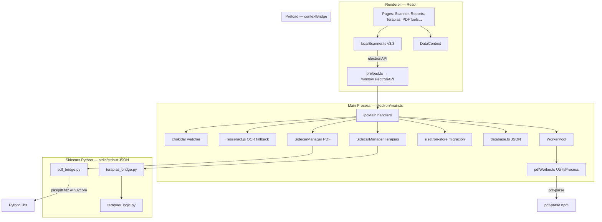
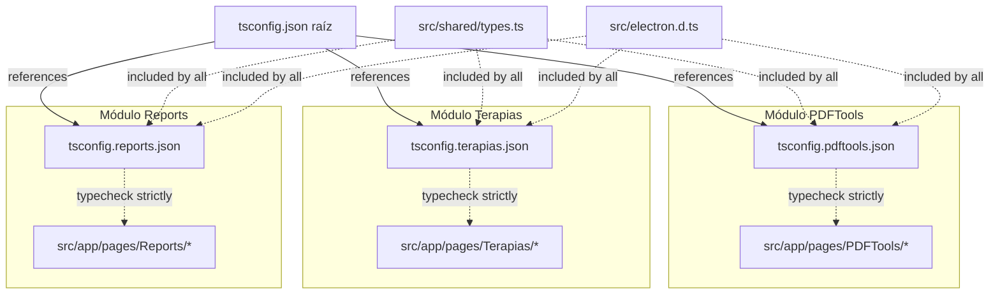

# CONTEXT.md — ControlHub

> Documento técnico para IAs y sesiones nuevas. **No es documentación de usuario.**
> Última revisión contra código: 2026-06-28. Versión app: **3.2.0** (`package.json`).
> Repositorio standalone — proyectos de referencia (COTU Analytics, Organizador robusto) ya integrados y eliminados del workspace.

---

## 1. Descripción del proyecto

**ControlHub** es una aplicación de escritorio Windows para operaciones documentales en un entorno clínico/administrativo colombiano:

| Módulo | Función |
|--------|---------|
| **Escáner / Analytics (COTU)** | Recorre carpetas, identifica PDFs de facturas COTU, extrae número COTU, aseguradora, montos, fechas; genera reportes exportables |
| **Reportes / Historial** | Tabla filtrable, export CSV/XLSX/PDF, historial de sesiones de escaneo |
| **Terapias** | Flujo Word → edición → PDF con regla SS, estructura `Año/Mes/Día/Paciente`, respaldo |
| **PDF Tools** | 22 herramientas PDF vía sidecar Python (merge, split, OCR, conversiones Office, etc.) |
| **Dashboard** | KPIs del escaneo activo + contador de docs Word pendientes en carpeta terapias |
| **Settings** | Columnas visibles, profundidad de escaneo, aseguradoras custom, operador, rutas |

**Origen:** fusión histórica de **COTU Analytics** (escáner/facturas) + **Organizador robusto** (terapias Word→PDF) + módulo **PDF Tools** propio. Los proyectos fuente ya fueron absorbidos; este repositorio es el producto único.

### Stack completo

| Capa | Tecnología | Versión (package.json) |
|------|------------|------------------------|
| Runtime desktop | Electron | ^40.6.0 |
| UI | React + TypeScript | React ^18.3.1, TS ^5.5.3 |
| Routing | React Router (hash) | ^7.13.0 |
| Build | Vite + esbuild | Vite ^6.3.5 |
| Estilos | Tailwind CSS v4 + Radix/shadcn | tailwindcss ^4.1.12 |
| PDF parsing (Node) | pdf-parse | ^1.1.1 |
| Watcher | chokidar | ^5.0.0 |
| Concurrencia escaneo | p-limit | ^7.3.0 |
| OCR fallback | tesseract.js (main process) | ^5.1.0 |
| Config runtime | electron-store (solo flags de migración) + settings.json / database.json | ^11.0.2 |
| Sidecars | Python embebido (win32com, pikepdf, PyMuPDF, pytesseract) | `python-embed/` |
| Empaquetado | electron-builder + NSIS | ^26.8.1 |
| Load test CLI | tsx + pdf-parse | tsx ^4.22.4 (dev) |

**Plataforma objetivo:** Windows 10/11. Rutas hardcodeadas a OneDrive/Tesseract en varios puntos — **no portable cross-platform sin trabajo**.

---

## 2. Arquitectura



### Aislamiento de módulos (Layer Separation)

Para garantizar la independencia, desacoplamiento y consistencia de los submódulos principales del frontend, se ha implementado una estrategia de segregación y typechecking por módulos usando archivos `tsconfig` dedicados:

*   **Estrategia TSConfig:** Cada módulo de negocio independiente tiene su propio archivo de configuración que extiende al principal:
    *   [tsconfig.pdftools.json](file:///C:/DEV/TODO%20EN%20UNO/ControlHub/tsconfig.pdftools.json) (Herramientas PDF)
    *   [tsconfig.terapias.json](file:///C:/DEV/TODO%20EN%20UNO/ControlHub/tsconfig.terapias.json) (Organizador de Terapias)
    *   [tsconfig.reports.json](file:///C:/DEV/TODO%20EN%20UNO/ControlHub/tsconfig.reports.json) (Reportes COTU Analytics)
*   **Propósito de `noEmit: true`:** Dado que el compilador y empaquetador del build de producción es Vite (a través de `esbuild` para transpilación veloz y `rollup` para bundling), los archivos `tsconfig.*.json` tienen como única responsabilidad la **verificación estática de tipos (typechecking)** sin generar archivos de salida (`js`), evitando conflictos en el output.
*   **Archivos Incluidos (`include`):** Cada tsconfig del módulo restringe su análisis de forma estricta a su ruta bajo `src/app/pages/<Modulo>`, pero incluye de forma explícita las dependencias comunes y globales para la resolución de tipos:
    *   El archivo de tipos globales `src/electron.d.ts` (para `window.electronAPI`).
    *   Interfaces de dominio centralizadas en `src/shared/types.ts`.
    *   Contextos, componentes y utilidades compartidas requeridas.



### Flujo COTU (escaneo de facturas)

```text
Usuario elige carpeta
  → localScanner.scanLocalDirectory()
  → IPC fs:readDirectory (main, cancelable por scanId)
  → por carpeta COTU: identifyInvoicePdf() [capa 1 nombre, capa 2 contenido]
  → IPC fs:parsePdf → WorkerPool → pdfWorker → pdf-parse
  → [fallback] IPC ocr:extractText → sidecar pdf_to_jpg + Tesseract
  → extracción regex: COTU, monto COP, aseguradora, fechas
  → DataContext.addToHistory + setCurrentScan
  → IPC db:saveScan → database.json
  → navigate("/reports")
```

### Flujo Terapias

```text
Terapias UI → IPC terapias:list_docs
  → [Paso 1] Validación existencia vía IPC fs:listFiles
  → Helper getFinalPathPreview (previsualización ruta AÑO/MES/DÍA)
  → IPC terapias:prepare (mueve + abre Word)
  → terapias_bridge.py (Word COM persistente)
  → terapias_logic.py (SS, sanitize_filename, build_folder_structure)
  → [Paso 2] IPC terapias:finalize (PDF + backup)
  → log rotativo ~/Documents/TERAPIAS/organizar_log.txt
```

### Flujo PDF Tools

```text
PDFTools UI → IPC pdf:* (22 handlers)
  → pdf_bridge.py (pikepdf, PyMuPDF, subprocess, pytesseract)
  → respuesta JSON al renderer
```

**Arquitectura modularizada (2026-06-29):**
```text
PDFTools UI → IPC pdf:* (22 handlers)
  → pdf_bridge.py (router/dispatcher - 250 líneas)
  → engines/*.py (motores individuales)
  → pdf_utils.py (utilidades compartidas)
  → respuesta JSON al renderer
```

**Estado de migración (completada):**
- `pdf_bridge.py` reducido de ~1500 líneas a 250 líneas (solo router/dispatcher)
- **10/10 motores** migrados limpiamente a `electron/sidecar/engines/`
- **0 duplicados** restantes en `pdf_bridge.py`
- Todas las utilidades consolidadas en `pdf_utils.py`

**Motores migrados a `electron/sidecar/engines/`:**
- `compress.py` - Compresión de PDFs (Ghostscript, pikepdf, PyMuPDF) ✅
- `merge.py` - Fusión de múltiples PDFs ✅
- `split.py` - División de PDFs por rangos ✅
- `p2w.py` - PDF a Word con OCR integrado y detección de firmas ✅
- `ocr.py` - OCR de PDFs escaneados ✅
- `office_to_pdf.py` - Word/Excel/PPT a PDF (COM) ✅
- `simple_ops.py` - Operaciones simples (rotate, crop, delete, extract, reorder, page_numbers) ✅
- `image_ops.py` - Operaciones de imagen (jpg_to_pdf, pdf_to_jpg, thumbnails, html_to_pdf) ✅
- `security.py` - Operaciones de seguridad (protect, unlock, repair) ✅
- `watermark.py` - Marca de agua (texto, imagen) ✅

**Utilidades compartidas en `electron/sidecar/pdf_utils.py`:**
- `resolve_ghostscript_path()` - Búsqueda dinámica de Ghostscript (usado por compress.py)
- `resolve_tesseract_path()` - Búsqueda dinámica de Tesseract OCR (usado por ocr.py, p2w.py)
- `parse_pages_param()` - Parseo de rangos de páginas (usado por simple_ops.py)

### Protocolo custom

- `cotu://pdf?path=...` — sirve PDFs locales para preview en `<iframe>` sin abrir explorador.

### Comunicación sidecar

- **Protocolo:** una línea JSON por request/response en stdin/stdout.
- **SidecarManager:** cola FIFO de Promises; si el proceso muere, rechaza pendientes.
- **Auto-restart:** `maxRestarts = 3` — habilitado con backoff exponencial (P10) y límite de intentos.

---

## 3. Estructura de archivos clave

```
ControlHub/
├── CONTEXT.md                    ← documentación técnica (este archivo)
├── README.md                     ← onboarding público
├── RULES.md                      ← convenciones de desarrollo
├── package.json                  ← versión, scripts, deps
├── vite.config.ts                ← build React + Electron, manualChunks
├── scripts/
│   ├── loadTest.ts               ← load test CLI (Node puro, sin Electron)
│   └── verify-python-embed.js    ← verificación de runtime Python embebido
├── docs/                         ← documentación adicional (análisis, desarrollo)
│   ├── DASHBOARD_DESARROLLO.md    ← estado de módulos y comandos
│   ├── MÓDULOS_LISTOS.md         ← análisis completo de módulos
│   └── code_organization_analysis.md ← evaluación de organización de código
├── electron/
│   ├── main.ts                   ← IPC, sidecars, watcher, OCR, ventana
│   ├── preload.ts                ← contextBridge → electronAPI
│   ├── logger.ts                 ← sistema de logging (main process)
│   ├── pdfWorker.ts              ← UtilityProcess: readFile + pdf-parse
│   ├── workerPool.ts             ← pool UtilityProcess
│   ├── database.ts               ← persistencia JSON userData
│   └── sidecar/
│       ├── terapias_bridge.py    ← IPC Python terapias
│       ├── terapias_logic.py     ← reglas SS/carpetas
│       ├── pdf_bridge.py         ← 22 comandos PDF
│       └── tests/                ← suites Python
├── src/
│   ├── main.tsx                  ← entry React
│   ├── electron.d.ts             ← tipos electronAPI
│   ├── shared/types.ts           ← fuente única de tipos de dominio
│   ├── app/
│   │   ├── App.tsx               ← ThemeProvider + DataProvider + Router
│   │   ├── routes.tsx            ← hash router, lazy routes
│   │   ├── types.ts              ← tipos locales de la app
│   │   ├── config/
│   │   │   └── validation.ts      ← validadores de settings
│   │   ├── constants/             ← constantes centralizadas
│   │   │   ├── colors.ts          ← colores para gráficos y UI
│   │   │   └── index.ts           ← meses, formatos, paginación, umbrales
│   │   ├── contexts/             ← DataContext, ThemeContext
│   │   ├── components/
│   │   │   ├── layouts/          ← MainLayout
│   │   │   ├── navigation/       ← Header, Sidebar
│   │   │   ├── shared/            ← FileDropZone, QuickActionCard, StatCard
│   │   │   └── ui/                ← componentes shadcn/Radix
│   │   ├── pages/
│   │   │   ├── Dashboard/         ← KPIs, ChartComponents
│   │   │   ├── Scanner/           ← ScanActions, ScanConfig, ScanProgress
│   │   │   ├── Reports/           ← ExportButtons, FiltersPanel
│   │   │   ├── Terapias/          ← flujo Word→PDF
│   │   │   ├── PDFTools/          ← 22 herramientas PDF
│   │   │   │   ├── components/    ← DocumentGrid, PageThumbnails, ResultView, etc.
│   │   │   │   ├── hooks/         ← usePdfTool, useFileQueue
│   │   │   │   ├── tools/         ← configuración de cada herramienta
│   │   │   │   └── utils/         ← validation
│   │   │   ├── Settings.tsx       ← configuración de usuario
│   │   │   ├── History.tsx        ← historial de sesiones
│   │   │   └── NotFound.tsx
│   │   ├── services/              ← lógica de negocio separada de UI
│   │   │   └── terapiasService.ts ← servicio de Terapias
│   │   └── utils/
│   │       ├── logger.ts         ← sistema de logging (renderer)
│   │       ├── errorHandler.ts    ← manejo de errores centralizado
│   │       ├── formatters.ts      ← formateadores de moneda/fechas
│   │       ├── mockData.ts       ← modo demo (Scanner)
│   │       └── localScanner/      ← motor COTU modularizado
│   │           ├── cache.ts       ← caché de PDF/OCR
│   │           ├── extractors.ts  ← extracción de metadatos
│   │           ├── invoiceIdentifier.ts ← identificación de facturas
│   │           └── pathResolver.ts ← resolución de rutas por fecha
│   └── tests/                    ← Vitest
├── python-embed/                 ← Python embebido producción (gitignored)
└── public/                       ← iconos estáticos
```

---

## 4. Problemas conocidos y su estado

| ID | Problema | Clasificación | Estado |
|----|----------|---------------|--------|
| P01 | `profiler:save` IPC eliminado de main.ts pero preload expone `reportProfilerData` y DataContext lo invoca al unmount | **Confirmado** | ✅ RESUELTO — Código profiler eliminado y limpieza de hooks |
| P02 | Optional chaining en filtros de Compañía y Año en Reports.tsx. activeScan cae a history[0] cuando currentScan es nulo. | **Confirmado** | ✅ RESUELTO — Unificación de activeScan (currentScan ?? history[0]) |
| P03 | Tipos centralizados en `src/shared/types.ts` | **Confirmado** | ✅ RESUELTO — fuente única importada en DataContext, localScanner, database, páginas |
| P04 | Triple persistencia settings/history: `localStorage` (`ordertrack-*`), `database.json` IPC, `electron-store` | **Confirmado** | **Corregido** — Triple persistencia unificada; `updateSettings` restaurada tras regresión |
| P05 | Claves terapias fragmentadas: `settings.terapiasDir` vs `terapiasSourceDir`; Settings solo escribe la primera; Terapias sincroniza ambas; main.ts IPC terapias lee `terapiasSourceDir` | **Confirmado** | ✅ RESUELTO — Unificación de claves de configuración y sincronización |
| P06 | IPC `pdf:pdf_to_excel` / `pdf:pdf_to_ppt` registrados en main.ts; **no implementados** en pdf_bridge.py; **no expuestos** en UI PDFTools | **Confirmado** | ✅ RESUELTO — Handlers huérfanos eliminados |
| P07 | `electron/pdfTools/*.js` (libreoffice, ghostscript, qpdf) existen pero no importados en main.ts | **Confirmado** | ✅ RESUELTO — Carpeta inexistente/eliminada |
| P08 | `electron.d.ts` incompleto → ~50 usos de `(window as any).electronAPI` pese al comentario "Fix #9 elimina @ts-ignore" | **Confirmado** | ✅ RESUELTO — Tipado completo y eliminación de (window as any) |
| P09 | Implementado getFinalPathPreview, validación de archivo en carpeta origen via listFiles, diálogo de confirmación muestra Ruta Final completa AÑO/MES/DÍA/PACIENTE. | **Confirmado** | ✅ RESUELTO — Paridad con Organizador robusto y validación SS |
| P10 | Sidecar auto-restart deshabilitado (`maxRestarts=0`); sidecar caído requiere click manual en Sidebar | **Confirmado** | ✅ RESUELTO — auto-restart con límite 3 y backoff exponencial |
| P11 | Rutas duplicadas `/` y `/dashboard` → mismo componente | **Confirmado** | **Corregido** — Eliminada ruta `/dashboard` |
| P12 | Suspense doble: routes.tsx + MainLayout.tsx | **Confirmado** | ✅ RESUELTO — Consolidado en routes.tsx |
| P13 | Dashboard empty state muestra `MOCK_DASHBOARD_DATA` difuminado detrás del overlay | **Confirmado** | ✅ RESUELTO — Implementado empty state limpio y eliminación de mock data |
| P14 | README dice v1.0.0 y "23 herramientas PDF"; package.json v3.2.0; UI tiene **22** tools | **Confirmado** | **Corregido** — Sidebar agrupado por dominios e iconos actualizados |
| P15 | `dialog:selectDirectory` IPC en main.ts no expuesto en preload; UI usa `select-directory` | **Confirmado** | ✅ RESUELTO — Handler alineado y expuesto en preload |
| P16 | `html2canvas`, `pdf-lib` en package.json/vite chunks; **sin imports en src/** | **Confirmado** | ✅ RESUELTO — `html-to-image` removido (no se usaba); `jsPDF` reemplazado por render HTML→PDF en el sidecar Python (`pdf_bridge.py`) para reducir el bundle y unificar renderizado; dependencia removida de `package.json`. |
| P17 | Tesseract ruta fija `C:\Program Files\Tesseract-OCR\tesseract.exe` en pdf_bridge.py | **Confirmado** | ✅ RESUELTO — Detección dinámica y configuración de ruta en Settings; `settings.tesseractPath` ahora se lee desde AppSettings y electron-store. |
| P18 | Race en DataContext init: `currentScan === null` check en línea 237 usa state stale del closure inicial | **Probable** | ✅ DESCARTADO — Riesgo puramente teórico. `currentScan` solo se setea por `initData` al arranque o por acción del usuario; no hay procesos paralelos que lo modifiquen en esa ventana. |
| P19 | SidecarManager: requests concurrentes comparten cola FIFO pero **sin correlación request/response** si Python responde fuera de orden | **Confirmado** | ✅ RESUELTO — Correlación por ID incremental en SidecarManager y bridges |
| P20 | Memory leak `pdfTextCache`: Descartado por evidencia empírica. Fase full mostró Δ Heap = -11.63 MB (GC activo). | **Descartado** | ✅ DESCARTADO — El cache se limpia automáticamente al inicio de cada sesión vía `pdfTextCache.clear()` en `scanLocalDirectory`. |
| P21 | `load-test` fase `full` reprocesa los mismos 100 PDFs de baseline | **Confirmado** | Diseño actual — no es bug, es decisión de medición |
| P22 | main.ts load test embebido rompió sintaxis | **Confirmado** | **Corregido** — eliminado; script en `scripts/loadTest.ts`. |
| P23 | Optional chaining en filtros de Compañía y Año en Reports.tsx. activeScan cae a history[0] cuando currentScan es nulo. | **Probable** | ✅ RESUELTO — Fix (aplicar en Reports) |
| P24 | Tests: solo 2 suites Python sidecar; **cero** tests Electron/React/E2E | **Confirmado** | ✅ RESUELTO — Suite de tests Vitest para localScanner implementada |
| P25 | Operador default distinto: Sidebar "Operador ControlHub" vs DataContext default "Usuario Admin" | **Confirmado** | ✅ RESUELTO — Unificado operador y consumo centralizado de settings |
| P26 | Rendimiento Parsing PDF: No es cuello de botella. 37ms promedio, 0 errores en 67 archivos. | **Optimizado** | Comportamiento esperado |
| P27 | Virtualización de tablas | Baja Prioridad | ✅ DESCARTADO — `Reports.tsx` renderiza solo `paginatedInvoices`, no `filteredInvoices`. `rowsPerPage` viene de `settings.display.rowsPerPage` y `paginatedInvoices = sortedInvoices.slice((currentPage - 1) * rowsPerPage, currentPage * rowsPerPage)`, por lo que la tabla nunca intenta renderizar todas las filas a la vez. Dataset real máximo = 67 filas; virtualización no aporta mejora significativa ni justifica la complejidad adicional. |
| P28 | Selector de sesión en Reportes (dropdown con fecha, N facturas y ruta) | **Nuevo** | ✅ RESUELTO — Implementado dropdown en Reports.tsx |
| P29 | Auto-detección de Word en carpeta origen (Terapias) | **Nuevo** | ✅ RESUELTO — Botón "Buscar Word en carpeta" con selección inteligente |
| P30 | Validación de código SS en nombre de entrada (Terapias) | **Nuevo** | ✅ RESUELTO — Diálogo de advertencia y normalización de PACIENTE_DESCONOCIDO |
| P31 | Terapias no auto-detecta archivos Word al entrar al módulo — `fetchDocs` useEffect con dependencias incorrectas | **Confirmado** | ✅ RESUELTO — settings.terapiasDir agregado a dependencias del useEffect en Terapias/index.tsx |
| P32 | `incomingFile` en PDFTools era variable de módulo fuera del ciclo React | **Confirmado** | ✅ RESUELTO — Migrado a useState; banner visible cuando llega archivo sin herramienta activa |
| P33 | Pre-probe de resolución de ruta para escaneo por día y rango personalizado — `scanLocalDirectory()` llamaba a `fs:readDirectory` directamente sin pre-probe. No existía código que resolviera la subcarpeta AÑO/MES/DÍA antes de iniciar la traversal; `applyDateFilter` corría post-proceso sobre el árbol completo. | **Confirmado** | ✅ RESUELTO — `resolveTargetDayFolder()` y `resolveTargetRangeFolder()` implementadas en localScanner.ts con patrones: mes (MM-NOMBRE, MM-DE NOMBRE, MM. NOMBRE, MM NOMBRE), día (DD DE NOMBRE, DD NOMBRE, DD); rango usa mes/año cuando aplica. Búsqueda combinatoria → fallback full scan. Logs: `[PRE-PROBE] resolved to:` o `no match found`. |
| P34 | Reportes PDF preview puede fallar por allowlist de IPC si la carpeta escaneada no está registrada como aprobada. | **Confirmado** | ✅ RESUELTO — añadido `security:registerApprovedDirectory` en el renderer y main; `window.electronAPI.security.registerApprovedDirectory` ahora asegura que la carpeta raíz escaneada se permita para preview de PDF en Reports. |
| P35 | Settings sin anclas — imposible navegar a sección específica | **Confirmado** | ✅ RESUELTO — ids scanning/terapias + scroll por location.state (evita conflicto con createHashRouter) |
| P34 | Dashboard mostraba solo contador de Terapias, sin acceso a docs individuales | **Confirmado** | ✅ RESUELTO — Lista hasta 3 docs clickeables con preloadedDoc; fallback silencioso si listDocs falla |
| P35 | Claves legacy ordertrack-* y cotu-last-path en localStorage sin respaldo IPC | **Confirmado** | ✅ RESUELTO — Migrado theme y lastScanPath a AppSettings; eliminado todo localStorage del renderer |
| P36 | ThemeProvider por encima de DataProvider — useData() fallaba en runtime | **Confirmado** | ✅ RESUELTO — Invertido orden en App.tsx: DataProvider envuelve ThemeProvider |
| P37 | Cero atajos de teclado globales y en Terapias | **Confirmado** | ✅ RESUELTO — Globales Ctrl+1..5/H en MainLayout; Ctrl+O/F5/Ctrl+F en Terapias |
| P38 | `handle_compress` sin fallback fitz — sin GS el resultado era compresión básica | **Confirmado** | ✅ RESUELTO — Cadena GS → fitz → pikepdf; mejor compresión sin Ghostscript |
| P39 | `finally` defensivo faltante en conversiones COM (`word_to_pdf`, `excel_to_pdf`, `ppt_to_pdf`) | **Confirmado** | ✅ RESUELTO — finally defensivo en los 3 handlers COM |
| P40 | `handle_crop` usaba primera página como referencia — páginas mixtas se desplazaban | **Confirmado** | ✅ RESUELTO — Cropbox absoluto con clamp por página |
| P41 | `handle_pdf_to_word` sin detección de tipo PDF — mismo motor para todo | **Confirmado** | ✅ RESUELTO — Clasificador 5D (_classify_pdf): texto, imágenes, trazos, formularios, columnas; strategy_order según perfil |
| P42 | `handle_pdf_to_word` sin detección de PDF protegido | **Confirmado** | ✅ RESUELTO — _is_pdf_protected antes de intentar conversión |
| P43 | `handle_pdf_to_word` sin validación post-conversión — .docx vacío devolvía ok:True | **Confirmado** | ✅ RESUELTO — _validate_docx valida existencia y tamaño mínimo |
| P44 | `warning` del sidecar silenciado en UI — usuario no sabía que usó fallback | **Confirmado** | ✅ RESUELTO — warning en banner amarillo, pdf_profile y engine como chips en vista resultado |
| P45 | `handle_split`, `handle_jpg_to_pdf`, `handle_rotate`, `handle_delete_pages`, `handle_reorder_pages` sin finally ni validaciones | **Confirmado** | ✅ RESUELTO — finally defensivo + validación de inputs y outputs en los 5 handlers |
| P46 | `handle_watermark`, `handle_watermark_image`, `handle_extract`, `handle_add_page_numbers`, `handle_ocr` sin finally | **Confirmado** | ✅ RESUELTO — finally defensivo + validaciones en los 5 handlers |
| P47 | `_ok_result` definida dos veces en `handle_pdf_to_word` — versión sin `pdf_profile` quedaba muerta | **Confirmado** | ✅ RESUELTO — Unificada en una sola definición con pdf_profile opcional |
| P48 | `pythoncom.CoUninitialize()` llamado dos veces en happy path de `handle_pdf_to_word` | **Confirmado** | ✅ RESUELTO — finally externo como único responsable de CoUninitialize |
| P49 | FileDropZone modo múltiple sin preview visual — solo lista de texto | **Confirmado** | ✅ RESUELTO — Grid de cards con thumbnail via pdfthumb:// protocolo |
| P50 | Sin protocolo para servir imágenes PNG locales al renderer | **Confirmado** | ✅ RESUELTO — Protocolo pdfthumb:// registrado en whenReady |
| P51 | Sin IPC para thumbnail de PDF | **Confirmado** | ✅ RESUELTO — handle_pdf_thumbnail en pdf_bridge.py + IPC pdf:pdf_thumbnail |
| P52 | UI resultado no mostraba warning ni motor usado | **Confirmado** | ✅ RESUELTO — Banner amarillo warning + chips pdf_profile y engine |
| P53 | Cola automática multi-archivo en herramientas single-file — pendiente | **Nuevo** | ✅ RESUELTO — Procesamiento secuencial con UI de progreso por archivo |
| P55 | `isContentEditable` no existe en tipo `Element` — MainLayout.tsx y Terapias/index.tsx | **Confirmado** | ✅ RESUELTO — cast a `(document.activeElement as HTMLElement)?.isContentEditable` |
| P56 | `className` no aceptado en raíz de `<Select>` Radix UI — Reports.tsx | **Confirmado** | ✅ RESUELTO — envuelto en `<div className="...">` |
| P57 | `err` tipado como `{}` sin propiedad `message` — Settings.tsx | **Confirmado** | ✅ RESUELTO — cast a `(err as Error)?.message` |
| P58 | Persistencia dual: `settings.json` + `electron-store` para `terapiasDir`/`tesseractPath`/rutas Terapias | **Confirmado** | ✅ RESUELTO — `settings.json` como fuente única; migración one-time `migration.electronStoreSettings` en main; `electron-store` solo flags de migración |
| P59 | Pre-probe duplicado en `Scanner.tsx` y `localScanner.ts`; abort silencioso si falla resolución por día | **Confirmado** | ✅ RESUELTO — pre-probe solo en `localScanner.ts`; fallback a full scan + toast en Scanner |
| P60 | `config.getAll`/`setAll`/`delete` expuestos en preload sin handlers en main | **Confirmado** | ✅ RESUELTO — eliminados del preload |
| P61 | 11 de 13 dependencias `@radix-ui` en package.json apuntaban a `^1.0.3`, versión nunca publicada por el mantenedor (causa raíz ETARGET) | **Confirmado** | ✅ RESUELTO — Actualizadas a versión `latest` real vigente; verificado sin breaking changes aplicables en código actual; build/typecheck/test limpios |
| P62 | El aislamiento de módulos Terapias y PDFTools con archivos tsconfig dedicados fallaba debido a dependencias no declaradas y referencias incorrectas. | **Confirmado** | ✅ RESUELTO — Corregidos los archivos de configuración de TypeScript `tsconfig.terapias.json` y `tsconfig.pdftools.json`, corregida la firma de `listDocs()` en `electron.d.ts`, actualizados los mocks/spies en los tests y re-organizada la declaración de variables del renderizado para permitir la compilación limpia e independiente de ambos módulos. |
| P63 | Herramienta split solo permitía seleccionar carpeta de destino, sin opción de especificar nombre base para archivos generados. | **Confirmado** | ✅ RESUELTO — Modificado para usar `selectSavePath` en lugar de `selectDirectory`, permitiendo al usuario especificar un nombre base (ej: "mi_documento.pdf"). El sidecar Python (`pdf_bridge.py`) extrae el nombre base de la ruta y lo usa como prefijo para los archivos generados según el patrón de nombres seleccionado (part/range/custom). |
| P64 | Conversión PDF a Word sin detección de marcas de agua y configuración subóptima para preservación de formato, imágenes y logos. | **Confirmado** | ✅ RESUELTO — Mejorado el clasificador PDF (`_classify_pdf`) para detectar marcas de agua (texto en zona central, mayúsculas cortas). Agregado nuevo perfil "watermarked" que prioriza Word COM. Mejorada configuración de Word COM: usar `wdFormatXMLDocument` (12) en lugar de `wdFormatDocumentDefault` (16), con opciones de preservación (`EmbedTrueTypeFonts`, `SaveNativePictureFormat`, `SaveFormsData`). Configuración adaptativa de pdf2docx según perfil: escaneados (tolerancia 0.3, preservar imágenes), mixtos/watermarked (tolerancia 0.2, preservar layout), estándar (configuración original). |
| P65 | Herramientas merge y split sin detección de PDFs protegidos con contraseña. | **Confirmado** | ✅ RESUELTO — Agregada detección de PDFs protegidos en `handle_merge` usando `pikepdf.PasswordError` y verificación de `is_encrypted`. Agregada detección en `handle_split` usando `doc.needs_pass` de fitz. Ambos handlers ahora retornan error claro indicando usar la herramienta 'Desbloquear PDF' primero cuando detectan archivos protegidos. |
| P66 | Feedback visual de drag and drop en DocumentGrid básico, sin animaciones ni indicadores claros. | **Confirmado** | ✅ RESUELTO — Mejorado feedback visual en `DocumentGrid.tsx`: borde más grueso (4px), animación pulse, icono Upload centrado, mensaje descriptivo de dos líneas, escala sutil del contenedor (scale-[1.01]), y fondo con tinte primario (bg-primary/10) al arrastrar archivos. |
| P67 | Manejo de errores en PageThumbnails genérico sin opción de reintentar. | **Confirmado** | ✅ RESUELTO — Mejorado manejo de errores en `PageThumbnails.tsx`: mensaje de error más descriptivo con detalles del error, agregado botón "Reintentar" para recargar la página, mejor captura de errores con verificación de instancia de Error. |
| P68 | Conversión PDF a Word sin reporte de progreso ni contexto detallado del resultado. | **Confirmado** | ✅ RESUELTO — Aplicado estilo de ejecución de merge (iLovePDF) a `handle_pdf_to_word`: validaciones mejoradas (existencia archivo, directorio salida, PDF protegido), reporte de progreso vía stderr (starting, strategy, opened, saving), resultado enriquecido con `page_count`, `strategy_used`, `input_size`, `output_size` para dar contexto completo de la conversión. |
| P69 | Herramienta PDF a Word usa FileDropZone antiguo en lugar de DocumentGrid, mostrando ruta completa y sin miniaturas visuales. | **Confirmado** | ✅ RESUELTO — Migrado `p2w` (PDF a Word) a usar DocumentGrid en `index.tsx`: ahora muestra miniaturas visuales del PDF, oculta la ruta completa del archivo (solo nombre truncado), usa tarjeta con borde redondeado y sombra suave, y mantiene consistencia visual con merge. Funciones de reordenar y ordenar deshabilitadas para p2w (solo aplicables a merge). |
| P70 | Error "too many values to unpack (expected 7, got 8)" en _classify_pdf de PyMuPDF. | **Confirmado** | ✅ RESUELTO — Corregido desempaquetado en línea 1204 de `pdf_bridge.py`: `page.get_text("words")` ahora devuelve 8 valores (incluyendo `direction`) en versiones recientes de PyMuPDF. Agregado `direction` al desempaquetado. |
| P71 | PDF a Word usa dos motores en cascada (Word COM + pdf2docx) causando diálogo de Word. | **Confirmado** | ✅ RESUELTO — Eliminado motor Word COM que causaba diálogos de confirmación. Ahora usa solo pdf2docx con configuración adaptativa según perfil: escaneados (tolerancia 0.3 para OCR), mixtos/watermarked (tolerancia 0.2), estándar. La detección de tablas e imágenes es automática en pdf2docx (no requiere parámetros explícitos). |
| P73 | Perfil "scanned" en PDF a Word no aplicaba OCR real, solo cambiaba parámetros de pdf2docx. | **Confirmado** | ✅ RESUELTO — Implementado OCR real usando pytesseract en `handle_pdf_to_word`: agregada función `_apply_ocr_to_pdf` que usa Tesseract para extraer texto de cada página como imagen y genera PDF con texto. Cuando el perfil es "scanned", se aplica OCR antes de pdf2docx. Si OCR falla, continúa con conversión sin OCR (con warning). Reporte de progreso de OCR vía stderr (ocr_start, ocr_complete). |
| P72 | Previsualización de documentos en PDF a Word no carga miniaturas. | **Confirmado** | ✅ RESUELTO — Agregado `activeTool?.id === 'p2w'` al useEffect de carga de miniaturas en `index.tsx`. Ahora las miniaturas se cargan correctamente para PDF a Word además de merge. |
| P74 | Sidecar Python pdf_bridge.py monolítico con ~1400 líneas, difícil de mantener y escalar. | **Confirmado** | ✅ RESUELTO — Modularización completa: extracción de utilidades a `pdf_utils.py` y migración de 22 handlers a archivos individuales en `electron/sidecar/engines/`. |
| P75 | Error "motor compress no disponible" tras migración por falta de `pdf_utils.py`. | **Confirmado** | ✅ RESUELTO — Creado `electron/sidecar/pdf_utils.py` con funciones compartidas (`resolve_ghostscript_path`, `resolve_tesseract_path`, `parse_pages_param`). |
| P76 | Nivel de compresión invalido por `parseInt` en frontend. | **Confirmado** | ✅ RESUELTO — Eliminado `parseInt` en `index.tsx` líneas 219 y 626 para pasar string directamente al backend. |
| P77 | Motor compress sin validación de niveles ni reporte de progreso. | **Confirmado** | ✅ RESUELTO — Validación de niveles (screen, ebook, printer, prepress, default, fast), reporte de progreso vía stderr (COMPRESS_PROGRESS). |
| P78 | Motor pdf_to_word sin validación de extensión .docx ni reporte de progreso detallado. | **Confirmado** | ✅ RESUELTO — Validación de extensión .docx, reporte de progreso vía stderr (CLASSIFY_PROGRESS, OCR_PROGRESS, PDF2WORD_PROGRESS). |
| P79 | Detección de firmas en PDF a Word dependía de palabras clave en español y correlación de texto con DOCX. | **Confirmado** | ✅ RESUELTO — Sistema de puntuación estructural independiente de idioma: posición (tercio inferior), tamaño relativo, proporción de aspecto, densidad de píxeles no blancos. Umbral score >= 7. Inserción al final del DOCX agrupadas por página como imágenes inline seleccionables. |
| P80 | Parámetros de pdf2docx subóptimos para preservación de imágenes pequeñas (firmas). | **Confirmado** | ✅ RESUELTO — Ajuste de image_overlap_threshold=0.5 y float_image_ignorable_gap=20.0 en todos los perfiles (scanned, mixed, watermarked, estándar). |
| P81 | Motor OCR duplicado en pdf_bridge.py con resolve_tesseract_path también duplicado. | **Confirmado** | ✅ RESUELTO — Migrado a engines/ocr.py, resolve_tesseract_path unificado en pdf_utils.py con check de pytesseract, eliminado código duplicado de pdf_bridge.py. |
| P82 | Imports de motores en pdf_bridge.py no explícitos (from X import Y vs from engines.X import Y). | **Confirmado** | ✅ RESUELTO — Todos los imports cambiados a forma explícita from engines.X import handle_X. |
| P83 | Motor security.py duplicado en pdf_bridge.py (handle_protect, handle_unlock, handle_repair). | **Confirmado** | ✅ RESUELTO — Eliminado código duplicado de pdf_bridge.py, versión en engines/security.py idéntica con sus propios imports. |
| P84 | Flujo de herramienta Unir PDFs: `operationCompleted` no se establecía en primera ejecución, herramientas de continuación no mostraban orden correcto (PDF a Word no aparecía primero), y archivo se guardaba automáticamente con `askBeforeSave` activo. | **Confirmado** | 🔄 EN PROGRESO — Corregido `operationCompleted` vía useEffect, orden de herramientas respetando NEXT_ACTION_MAP (PDF a Word primero), uso de directorio temporal cuando `askBeforeSave` activo para evitar guardado automático. Error Dynamic require of os corregido usando process.env.TEMP. |
| P84 | Mejoras de calidad en módulo Terapias: finally defensivo faltante en handle_finalize, tipado débil en prepareResult, excepciones genéricas en validaciones, búsqueda sin debounce, duplicación de lógica de selección, constantes mágicas, optimización de renderizado. | **Confirmado** | ✅ RESUELTO — Implementadas 9 mejoras: (1) finally defensivo en handle_finalize para prevenir locks de Word, (2) interface PrepareResult con tipado fuerte, (3) excepción específica ValueError con mensaje descriptivo, (4) bare except reemplazado por (OSError, PermissionError), (5) debounce 300ms en búsqueda de pacientes, (6) validación de tamaño máximo 50MB en archivos, (7) función selectDocument extraída para eliminar duplicación, (8) constantes LOG_MAX_BYTES, LOG_BACKUP_COUNT, HISTORY_MAX_ENTRIES, MAX_FILE_SIZE, (9) useMemo para optimizar renderizado de historial. |
| P85 | Herramienta Unir PDFs: validaciones manuales duplicadas, errores genéricos sin tipado AppError, tests no verificaban tipos de error. | **Confirmado** | ✅ RESUELTO — (1) Eliminadas validaciones manuales duplicadas en merge.ts, manteniendo solo validación Zod centralizada. (2) Migrados todos los throw new Error() a throw new AppError(ErrorType.MERGE_INPUT, message). (3) Actualizados tests en merge.test.ts para verificar AppError y ErrorType.MERGE_INPUT. (4) Barra de progreso ya implementada en UI (líneas 1116-1132 de index.tsx) con listener funcional en main.ts y preload.ts. |
| P86 | TypeError: Cannot read properties of undefined (reading 'getTempPath') en index.tsx línea 765. | **Confirmado** | ✅ RESUELTO — Corregido namespace incorrecto: cambiado `window.electronAPI.system.getTempPath()` a `window.electronAPI.getTempPath()`. Agregada declaración de tipo para `getTempPath()` en `electron.d.ts` (líneas 102-104). |
| P87 | Inconsistencia visual entre herramientas: merge usaba DocumentGrid con miniaturas, drag & drop, ordenamiento; otras usaban FileDropZone básico. | **Confirmado** | ✅ RESUELTO — Reemplazado FileDropZone por DocumentGrid en todas las herramientas PDF. Ahora todas tienen: grid de tarjetas (grid-cols-2 a lg:grid-cols-5), miniaturas aspect 3/4, drag & drop para reordenar, botón A-Z/Z-A, badges de orden, metadata (tamaño/páginas), acciones hover (previsualizar, rotar, eliminar), indicador grip, dropzone visual con overlay. Mantenido FileDropZone solo para watermark_image. |
| P88 | Thumbnails de PDF solo cargaban en merge y PDF a Word, otras herramientas mostraban "Cargando..." permanentemente. | **Confirmado** | ✅ RESUELTO — Eliminado condicional `(activeTool?.id === 'merge' || activeTool?.id === 'p2w')` en useEffect de carga de thumbnails. Ahora thumbnails cargan para todas las herramientas. Corregido tipo de retorno de `pdfThumbnail` en `electron.d.ts` agregando `page_count?: number`. |
| P89 | Funcionalidad de merge rota al cambiar selectFiles por selectFile en onAdd handler. | **Confirmado** | ✅ RESUELTO — Restaurado `selectFiles` para herramientas multi-file (merge, jpg_to_pdf, p2w) y `selectFile` para single-file tools. Agregado tipo `selectFiles` en `electron.d.ts`. Adaptado `onAdd` y `onAddFiles` según contexto de cada herramienta. |
| P90 | Error "El archivo de salida debe tener extensión .docx" al continuar de merge a PDF a Word. | **Confirmado** | ✅ RESUELTO — Corregido generación de output en botones de continuación. Ahora usa `tool.newExt` para generar ruta con extensión correcta para la herramienta destino. |
| P91 | Botón "Enviar a Terapias" no copiaba archivo a carpeta configurada. | **Confirmado** | ✅ RESUELTO — Implementado copia silenciosa usando `settings.terapiasDir` como destino. Agregado import de `useData` en PDFTools. Si falla copia o no hay configuración, muestra error y no navega. |
| P92 | preloadedDoc en Terapias solo establecía nombre, no seleccionaba documento automáticamente. | **Confirmado** | ✅ RESUELTO — Mejorado `preloadedDoc` en Terapias: verifica si documento existe en carpeta origen configurada, si lo encuentra selecciona automáticamente con `selectDocument`, si no muestra warning. Preserva lógica existente de búsqueda y selección manual. |

---

## 5. Decisiones de arquitectura tomadas

| Decisión | Razón | Alternativas descartadas |
|----------|-------|--------------------------|
| **Electron + React** | Unificar COTU (ya Electron) + Terapias + PDF en una shell; UI moderna | Mantener Organizador Tkinter separado; Tauri [no evaluado en repo] |
| **Hash router** (`createHashRouter`) | Electron carga `file://` o dev server; hash evita problemas de pathname | BrowserRouter — problemas con file protocol |
| **Sidecars Python persistentes** | Word COM (`win32com`) requiere proceso vivo; conversiones PDF pesadas fuera del main | Invocar Python por subprocess por operación (más lento); portar todo a Node (Word COM imposible) |
| **pdf-parse en UtilityProcess pool** | No bloquear main; reutilizar workers (Fix #10) | parsePdf sync en main; subprocess por PDF |
| **JSON línea a línea con sidecars** | Simple, debuggeable | gRPC, named pipes — overkill |
| **electron-store + database.json** | Historial en JSON; settings en `settings.json`; electron-store solo para flags de migración one-time | Triple persistencia con localStorage — unificada en v3.2+ |
| **DataContext monolítico** | Herencia COTU; suficiente para escala actual | Redux/Zustand — no adoptado |
| **Lazy routes + Suspense** | Reducir bundle inicial | Import estático — bundle más grande |
| **Load test como CLI Node** (`scripts/loadTest.ts` + pdf-parse) | Aísla benchmark de Electron; evita romper main | Load test embebido en main con `--run-load-test` — **descartado tras incidente sintaxis** |
| **Python embebido en extraResources** | Deploy sin Python del sistema |
| **OCR en main (Tesseract.js) + pdf_to_jpg sidecar** | Fallback cuando pdf-parse no extrae texto |
| **Generación de PDF (renderer → sidecar HTML→PDF)** | Reemplazado `jsPDF` en el renderer por render HTML frente al sidecar Python (`html_to_pdf`) para reducir el bundle, reutilizar la cadena de herramientas PDF existente y mantener fidelidad de layout en Windows empaquetado. | Mantener `jsPDF` en el renderer (aumenta bundle y duplicación de motores de PDF) |

---

## 6. Deuda técnica priorizada

Ordenada por **impacto real en producción/uso diario**, no severidad teórica:

### Deudas resueltas recientemente (2026-06-25 - P63)

| Deuda | Prioridad | Estado |
|-------|-----------|--------|
| Tipado débil electron.d.ts | Media | ✅ RESUELTO |
| Tipado débil Dashboard.tsx | Media | ✅ RESUELTO |
| Console.log exceso (logging) | Baja | ✅ RESUELTO |
| Comentarios TODO/FIXME | Baja | 🔄 PARCIAL |
| Versión comentario desactualizada | Baja | ✅ RESUELTO |
| Navegación por teclado FileDropZone | Baja | ✅ RESUELTO |

### Deudas pendientes

| Deuda | Prioridad | Estado |
|-------|-----------|--------|
| TODO PDFTools hooks | Media | ✅ RESUELTO |
| Verificación runtime Radix | Media | ✅ RESUELTO |
| Manejo de errores | Media | ✅ RESUELTO |
| Layer separation | Media | ✅ RESUELTO (parcial: servicio creado, migración parcial UI) |
| Rutas hardcodeadas OneDrive/Tesseract | Media | ✅ RESUELTO |
| Validación tamaño database.json | Media | ✅ RESUELTO |
| SidecarManager validación payload | Media | ✅ RESUELTO |
| Manejo errores OCR fallback | Media | ✅ RESUELTO |
| Timeout operaciones database | Media | ✅ RESUELTO |
| Cobertura de pruebas | Baja | Pendiente |
| Validación de inputs | Baja | Pendiente |
| Virtualización tablas (P27) | Baja | Pendiente |
| Script npm tests sidecars | Baja | Nueva |
| Dependencias no utilizadas | Baja | ✅ RESUELTO (verificadas, todas en uso) |
| Encoding corruptos preload.ts | Baja | ✅ RESUELTO |
| Comentarios duplicados database.ts | Baja | ✅ RESUELTO |

### Recomendación de acción

**Fase 1 (Inmediata - Críticas):** ✅ COMPLETADO

**Fase 2 (Corta - Alta prioridad):**
- ✅ Tipado fuerte en Dashboard.tsx - COMPLETADO
- ✅ Estandarizar imports - COMPLETADO
- ✅ Continuar extracción de componentes grandes - COMPLETADO (Reports, Dashboard)
- ✅ Tipado fuerte en electron.d.ts - COMPLETADO
- Verificación runtime de Radix v2 (requiere ejecución manual)
- Extraer componentes de Scanner.tsx (517 líneas)
- Implementar validación de payload en SidecarManager (Zod)

**Fase 3 (Media - Mejoras incrementales):**
- Migrar lógica PDFTools a hooks existentes (usePdfTool, useFileQueue) - REFACTORIZACIÓN GRANDE
- ✅ Implementar navegación por teclado en FileDropZone - COMPLETADO
- ✅ Implementar logging centralizado - COMPLETADO
- Mejorar manejo de errores (especialmente OCR fallback)
- Aumentar cobertura de pruebas
- Implementar timeouts en operaciones de base de datos

**Fase 4 (Larga - Optimización y limpieza):**
- Validación de inputs
- Virtualización de tablas (si es necesario)
- Tests de sidecars (definir script npm)
- Corregir encoding corruptos en preload.ts
- Documentar limitación de plataforma (rutas OneDrive/Tesseract)
- Implementar herramienta de análisis de dependencias (depcheck)
- Consolidar comentarios redundantes

1. **P13** — ✅ RESUELTO: Implementación de empty state limpio en Dashboard.
2. **P17** — ✅ RESUELTO: Tesseract path configurable y detección dinámica.
3. **P19** — ✅ RESUELTO: Correlación request/response por ID en sidecars.
4. **P28** — ✅ RESUELTO: Selector de sesión en Reportes.
5. **P29 + P30** — ✅ RESUELTO: Paridad operativa y seguridad en Terapias.
6. **P12 + P25** — ✅ RESUELTO: Limpieza de UI (Suspense y Operador).
7. **P15** — ✅ RESUELTO: Handler dialog:selectDirectory alineado y expuesto en preload.
8. **P07 + P16** — ✅ RESUELTO: Eliminación de código y dependencias muertas; `jsPDF` reemplazado por render HTML→PDF en el sidecar y eliminado de `package.json`.
9. **P20** — ✅ DESCARTADO: Memory leak pdfTextCache no existe.
10. **P27** — Virtualización de tablas (Baja prioridad)
11. **P31** — ✅ RESUELTO: Auto-detect Word al montar Terapias (useEffect dependencia fix).
12. **P32** — ✅ RESUELTO: Puente Reportes → PDF Tools (P32)
13. **P33** — ✅ RESUELTO: Settings anclas → `#scanning`, `#terapias` (P33)
14. **P34** — ✅ RESUELTO: Dashboard → Terapias doc pre-seleccionado (P34)
15. **P35/P36** — ✅ RESUELTO: Deprecar ordertrack-* y orden providers App.tsx (P35, P36)
16. **P37** — ✅ RESUELTO: Atajos de teclado globales y en Terapias (P37)

---

## 7. Convenciones del proyecto

### Naming

| Ámbito | Patrón | Ejemplo |
|--------|--------|---------|
| IPC main | `namespace:action` | `fs:parsePdf`, `terapias:prepare`, `pdf:merge` |
| Sidecar cmd | snake en JSON `cmd` | `{ cmd: 'list_docs', data: {...} }` |
| React pages | PascalCase archivo + export | `Scanner.tsx` → `export function Scanner` |
| Context hooks | `useData()`, `useTheme()` |
| localStorage legacy | prefijo `ordertrack-` | `ordertrack-settings`, `ordertrack-history`, `ordertrack-theme` |
| Scanner path cache | `cotu-last-path` |
| IDs escaneo | UUID v4 | `scanId` para cancelación |

### Tipos

- **Fuente única:** `src/shared/types.ts` — Invoice, ScanResult, AppSettings, ScanStats, etc.
- **Tipos IPC:** `src/electron.d.ts` complementa el contrato preload.

### Manejo de errores

| Capa | Patrón |
|------|--------|
| Sidecar Python | `{ ok: false, error: "..." }` en JSON stdout |
| IPC main | try/catch → `{ success: false, error }` o rethrow |
| Renderer | `toast.error()` (sonner) + console.error |
| parsePdf worker | `{ success: false, error }` → localScanner marca `parseError: true` |
| Sidecar caído | Sidebar chip rojo; click → `sidecar:reconnect` |

### Patrones IPC

```typescript
// Preload — contextBridge, no nodeIntegration
contextBridge.exposeInMainWorld('electronAPI', { ... });

// Renderer — preferir window.electronAPI, realidad: (window as any).electronAPI
await window.electronAPI.parsePdf(path, 1);

// Main — ipcMain.handle (async, retorna Promise)
ipcMain.handle('fs:parsePdf', async (_, pdfPath, maxPages) => { ... });

// Eventos main → renderer
win.webContents.send('scan-progress', payload);
// Preload: ipcRenderer.on + callback registrado
```

### Sidecar

- Un request = un JSON + `\n` a stdin.
- Una response = un JSON + `\n` en stdout.
- stderr reservado para logs; stdout **solo JSON** (sidecars redirigen print accidental a stderr).

### Routing

- Hash paths: `/`, `/scanner`, `/reports`, `/history`, `/pdf-tools`, `/terapias`, `/settings`
- Navegación programática post-escaneo: `navigate("/reports")` tras 1s
- State: `{ autoSelect: true }` en Scanner para abrir selector de carpeta

### Logging

El proyecto implementa un sistema de logging dual con niveles condicionales:

**Main Process (`electron/logger.ts`):**
- Niveles: `debug`, `info`, `warn`, `error`
- Configuración automática: `debug` en desarrollo, `error` en producción
- Inicialización: `logger.init(app.isPackaged)` en main.ts
- Métodos: `debug()`, `info()`, `warn()`, `error()`, `setLevel()`

**Renderer (`src/app/utils/logger.ts`):**
- Niveles: `debug`, `info`, `warn`, `error`
- Configuración automática: `debug` en dev server, `error` en file protocol
- Detección de entorno: `!window.location.protocol.includes('file')`
- Métodos: `debug()`, `info()`, `warn()`, `error()`, `setLevel()`

### Manejo de Errores

Sistema centralizado en `src/app/utils/errorHandler.ts`:

**Tipos de errores (`ErrorType` enum):**
- Sistema de archivos: `FILE_NOT_FOUND`, `FILE_READ_ERROR`, `DIRECTORY_NOT_FOUND`
- PDF: `PDF_PARSE_ERROR`, `PDF_CORRUPTED`, `PDF_PASSWORD_PROTECTED`
- OCR: `OCR_ERROR`, `OCR_ENGINE_NOT_FOUND`, `OCR_TIMEOUT`
- IPC/Red: `IPC_ERROR`, `NETWORK_ERROR`
- Validación: `VALIDATION_ERROR`, `INVALID_INPUT`
- Configuración: `CONFIG_ERROR`, `SETTINGS_ERROR`
- General: `UNKNOWN_ERROR`

**Clase `AppError`:**
- Extiende `Error` con propiedades: `type`, `context`, `originalError`
- Constructor: `new AppError(type, message, context?, originalError?)`

**Funciones utilitarias:**
- `handleError(error, context?)`: Maneja error centralizado con logging
- `withErrorHandling(fn, context, defaultValue?)`: Wrapper async con manejo de errores
- `createError(type, message, context?, originalError?)`: Factory de errores tipados
- `isErrorType(error, type)`: Verifica tipo de error

### Constantes Centralizadas

**Colores (`src/app/constants/colors.ts`):**
- `CHART_COLORS`: Array de 10 colores para gráficos (azules/slate)
- Colores semánticos: `PRIMARY_COLOR`, `SUCCESS_COLOR`, `WARNING_COLOR`, `ERROR_COLOR`, `INFO_COLOR`

**Generales (`src/app/constants/index.ts`):**
- `MONTHS_ORDER`: Meses en español (Enero, Febrero, ...)
- `DATE_FORMATS`: Formatos de fecha (`DISPLAY`, `ISO`, `MONTH_YEAR`)
- `PAGINATION`: Límites de paginación (`DEFAULT_PAGE_SIZE: 10`, `MAX_PAGE_SIZE: 100`)
- `CURRENCY_THRESHOLDS`: Umbrales de formateo (`BILLION`, `MILLION`, `THOUSAND`)

### Formateadores Centralizados

**Moneda (`src/app/utils/formatters.ts`):**
- `formatCOP(value)`: Formato compacto ($1.5M, $500K, $10,000)
- `formatCOPFull(value)`: Formato completo ($1,500,000.00)

### Layer Separation - Servicios

**Servicio de Terapias (`src/app/services/terapiasService.ts`):**
- Implementa lógica de negocio separada de la UI (RULES.10)
- Interfaz `TerapiasService` con métodos:
  - `listDocuments(sourceDir)`: Lista documentos pendientes
  - `autoDetectWord(sourceDir)`: Auto-detección de archivos Word
  - `prepareDocument(form, sourceDir)`: Prepara documento para edición
  - `finalizeDocument(outputPath, backupPath, patientName)`: Finaliza PDF
  - `searchPatients(query, sourceDir, destRoot?)`: Busca pacientes
  - `loadHistory()`: Carga historial de operaciones
  - `checkStatus(wordExecutablePath?)`: Verifica estado sidecar + Word
- Implementación `TerapiasServiceImpl` con normalización de metadatos
- Singleton exportado: `terapiasService`

### Modularización de localScanner

El motor COTU (`src/app/utils/localScanner.ts`) se ha modularizado en submódulos:

**`cache.ts`:**
- `simpleHash(str)`: Hash simple de strings
- `pdfTextCache`: Map de caché para PDF parsing
- `performOCR(pdfPath, ocrCache?)`: OCR con caché opcional
- `parsePdfCached(filePath, maxPages?, mtimeMs?)`: PDF parsing con caché

**`extractors.ts`:**
- `parseCOPNumber(raw)`: Parsea números COP con formato colombiano
- `extractAmountFromText(text)`: Extrae monto total de texto de factura
- `extractCotuFromPath(filePath)`: Extrae número COTU de ruta
- `extractExtendedMetadata(text, invoice)`: Extrae paciente, NIT
- `extractMetadataFromPath(fileData, fuseEngine)`: Extracción capa 1 (nombre)

**`invoiceIdentifier.ts`:**
- `identifyInvoicePdf(filePath)`: Identificación capa 1 + capa 2
- Lógica de doble capa: nombre archivo → contenido PDF

**`pathResolver.ts`:**
- `resolveTargetDayFolder(basePath, targetDate)`: Resolución por día específico
- `resolveTargetRangeFolder(basePath, startDate, endDate)`: Resolución por rango
- Patrones de mes: `MM-NOMBRE`, `MM-DE NOMBRE`, `MM. NOMBRE`, `MM NOMBRE`
- Patrones de día: `DD DE NOMBRE`, `DD NOMBRE`, `DD`

---

## 8. Comandos esenciales

Ejecutar desde `ControlHub/`:

```bash
# Desarrollo — Vite dev server + Electron (hot reload renderer)
npm run dev

# Build producción — React dist/ + Electron dist-electron (NO empaqueta instalador)
npm run build

# Build + instalador NSIS Windows
npm run build:electron

También se puede usar `build_desktop.bat` desde la raíz de `ControlHub` para cerrar instancias abiertas, limpiar builds previos y generar el instalador NSIS.

> El instalador completo necesita que `python-embed/` exista en la raíz del repositorio y que contenga `python.exe`.
>
> Validación: `release/ControlHub Setup 3.2.0.exe` existe y `release/win-unpacked/resources/python-embed/python.exe` está presente después del build.
>
> Nota actual: `npm run build:electron` usa NSIS y puede detenerse si `installer.nsh` produce la advertencia 6000 (`unknown variable/constant`) porque electron-builder trata cada warning de NSIS como error. La versión actual del instalador usa un helper PowerShell para generar `initial-config.json` durante la instalación, y la verificación con `scripts/verify-installer.ps1` ha devuelto `Verificacion completada: OK`.

# Preview del bundle Vite (sin Electron)
npm run preview

# Load test PDF parsing — Node puro, sin Electron
npm run load-test
# → escanea FACTURA DE MUESTRA/
# → escribe metrics/loadtest_<timestamp>.json + .md

# Diagnóstico manual de un PDF — usar load-test o escaneo real
```

**Notas no obvias:**
- `npm run build` compila **tres** targets Vite: renderer, main+pdfWorker, preload.
- `npm run dev` abre DevTools automáticamente (`main.ts` → `openDevTools()`).
- Load test requiere carpeta local `FACTURA DE MUESTRA/` con PDFs (gitignored; crear manualmente para benchmarks).
- Python sidecars en dev usan `python-embed/python.exe` relativo a cwd.
- `scripts/verify-python-embed.js` verifica la existencia del runtime Python embebido antes del build.
- Sidecar tests: [INCIERTO] `pytest electron/sidecar/tests/` — no hay script npm definido.

---

## 9. Lo que NO hacer

Decisiones ya evaluadas y **descartadas** — no re-proponer sin justificación nueva:

| ❌ No hacer | Por qué |
|-------------|---------|
| **Embeber load test en `electron/main.ts`** | Rompió el build (jun 2026). Usar `scripts/loadTest.ts`. |
| **Usar `ts-node` para scripts** | Se eligió `tsx` — más ligero, ya en devDependencies. |
| Migrar a BrowserRouter | Roto con Electron file protocol. |
| nodeIntegration: true en renderer | Violación de seguridad; preload + contextIsolation es el patrón actual. |
| Reemplazar sidecars Python por Node para Word/Terapias | Word COM requiere pywin32 en Windows. |
| Unificar todo en SQLite ahora | Migración grande; JSON + trimHistory funciona para escala actual — evaluar SQLite solo si crece el historial |
| Habilitar auto-restart sidecar sin límite | Auto-restart habilitado con `maxRestarts=3` y backoff exponencial (P10) |
| Duplicar lógica COTU en otro módulo | `localScanner.ts` es el único motor; no crear segundo scanner. |
| Importar código Electron desde `scripts/loadTest.ts` | Load test debe ser Node puro + pdf-parse. |
| Usar `electron/pdfTools/*.js` sin cablear | Código legacy no conectado; implementar en sidecar o eliminar. |
| Confiar en README para versión/arquitectura | README dice v1.0.0; fuente de verdad: `package.json` + este CONTEXT.md. |
| Recrear proyectos fuente separados (COTU Analytics, Organizador Tkinter) | Ya fusionados en ControlHub; mantener un solo repositorio. |
| Proponer fusión con apps Tkinter | Ya fusionado en Electron; Organizador queda como referencia UX. |
| Añadir `profiler:save` placeholder vacío | Fue anti-patrón del incidente load test; implementar completo o eliminar referencias. |

---

## 10. Apéndice: estado de build (2026-06-19)

- `npm run build` — **OK** (renderer + main + preload)
- `electron/main.ts` — **OK** (load test embebido eliminado)
- `npm run load-test` — **implementado, no ejecutado en CI** [INCIERTO en pipelines]

---

## 11. Estado del producto y pendientes

**Veredicto:** ControlHub cumple el objetivo de unificar COTU + Terapias + PDF Tools. El núcleo COTU supera la referencia original; Terapias tiene paridad operativa; PDF Tools es extensión propia (22 herramientas).

**Pendientes activos:**

No hay issues de alta prioridad abiertas.

| Prioridad | Tarea |
|-----------|-------|
| Baja | Virtualización de tablas (P27) |

**Completados recientemente:**

| Issue | Descripción |
|-------|-------------|
| P53 | ✅ Cola automática multi-archivo con procesamiento secuencial |

---

## 12. Comparativa histórica vs proyectos fuente

> Los proyectos originales ya no existen como repos separados; esta tabla documenta el grado de paridad alcanzado.

### COTU Analytics → ControlHub

| Capacidad | Referencia | ControlHub |
|-----------|------------|------------|
| Escaneo COTU | ✅ | ✅ + OCR, NIT/paciente, duplicados |
| Dashboard | LineChart | AreaChart + KPIs comparativos |
| Export | CSV/XLSX/PDF | ✅ |
| Watcher | ✅ | ✅ |
| Worker pool PDF | ✅ | ✅ |

### Organizador robusto → Terapias

| Capacidad | Organizador | ControlHub |
|-----------|-------------|------------|
| Regla SS + estructura carpetas | ✅ | ✅ (`terapias_logic.py`) |
| Word → PDF | ✅ | ✅ sidecar persistente |
| Historial + búsqueda paciente | ✅ vistas separadas | ✅ en una página |
| Confirmación pre-movimiento | ✅ | ✅ (P09) |
| Diálogo falta SS | ✅ | ✅ (P30) |
| Selector multi-doc | ✅ | ✅ (Auto-Word P29) |
| Atajos teclado (`Ctrl+O`, `F5`, `Ctrl+F`) | ✅ | ✅ (P37) |
| Config unificada (word_path, etc.) | ✅ | ✅ — `settings.json` vía `db:saveSettings` |
| Tests automatizados | 5 suites | 2 Python + Vitest |

### PDF Tools (módulo propio)

- **22 herramientas** en UI (no 23).
- **22 herramientas a nivel producción. Todos los handlers tienen finally defensivo, 
   validación de inputs/outputs y errores descriptivos. handle_pdf_to_word incluye 
   clasificador de contenido 5D y selección automática de motor.**
- Sidecar `pdf_bridge.py` con pikepdf, PyMuPDF, win32com, pytesseract.

---

## 13. Fricciones de navegación — estado

| Problema | Impacto | Estado |
|----------|---------|--------|
| Módulos COTU vs sidecars desconectados | Alto | ✅ RESUELTO — puente Reportes→PDF Tools implementado |
| Reportes sin selector de sesión | Alto | ✅ RESUELTO (P28) |
| Ruta duplicada `/` y `/dashboard` | Bajo | ✅ RESUELTO (P11) |
| Iconos ambiguos Reportes vs PDF Tools | Medio | ✅ RESUELTO — `BarChart3` / `FileStack` |
| Scanner → Settings genérico | Medio | ✅ RESUELTO — anclas `#scanning` / `#terapias` (P35) |
| Suspense doble | Bajo | ✅ RESUELTO (P12) |
| Branding legacy `ordertrack-*` | Bajo | ✅ RESUELTO — Migración one-time a AppSettings/database.json |
| Atajos teclado globales y Terapias | Medio | ✅ RESUELTO (P37) — Ctrl+1..5/H global; Ctrl+O/F5/Ctrl+F en Terapias |

---

## 14. Changelog de sesiones recientes

### 2026-06-28 — Orquestación de PDFTools, visualización de miniaturas, corrección IPC, suite de pruebas Vitest y optimización de Dividir PDF

- **Motor de Orquestación y Fix IPC PDFTools:** Implementada la lógica modular de ejecución de herramientas PDF (`executeTool.ts`, `compress.ts`, `merge.ts`, `split.ts`) e integrada con el sidecar Python (`pdf_bridge.py`). Resuelto error de validación `Payload validation failed: Unknown command: pdf_thumbnail` registrando el comando en `SIDECAR_COMMAND_TIMEOUTS` en `main.ts`.
- **Previsualización de Miniaturas y Protocolo Privilegiado:** Registrado esquema de protocolo `pdfthumb` como privilegiado antes de `app.whenReady()` y ajustado el handler de entrega en `main.ts` para servir miniaturas PNG temporales sin bloqueos de seguridad o Content Security Policy.
- **Optimización de la herramienta Dividir PDF (Split):** Integrada la visualización interactiva de páginas usando `PageThumbnails.tsx` en la herramienta `split`. Implementada la sincronización automática en tiempo real de la selección de miniaturas con el input de texto de rangos (`splitRanges`), incluyendo un botón para limpiar la selección.
- **Corrección de carga de miniaturas en Split/PageThumbnails:** Modificada la función `handle_page_thumbnails` en el sidecar Python (`pdf_bridge.py`) y `PageThumbnails.tsx` para generar y cargar imágenes usando el protocolo privilegiado `pdfthumb://` en lugar del protocolo bloqueado `file://`.
- **Gestión del estado de selección:** Añadido reinicio de `selectedPages` en `resetToolState` para evitar mantener páginas seleccionadas entre transiciones de herramientas.
- **Componentes de Cuadrícula e Interacción Merge:** Actualizado [DocumentGrid.tsx](file:///c:/DEV/TODO%20EN%20UNO/ControlHub/src/app/pages/PDFTools/components/DocumentGrid.tsx) para soportar reordenamiento interactivo por arrastre (`onReorder`), conteo dinámico de páginas, peso en KB/MB y formateo estético alineado con el tema nativo de la app.
- **Suite de pruebas de integración y unitarias:** Creados tests en Vitest (`compress.test.ts`, `merge.test.ts`, `split.test.ts`) y pruebas para `TerapiasService`, alcanzando 69 pruebas aprobadas exitosamente (`npm run test`).
- **Verificación de build:** `npm run build` ejecutado y validado limpiamente para los tres targets (renderer, main, preload).

### 2026-06-24 — P62: Reorganización de código - Centralización y limpieza

- **Centralización de formateadores:** creado `src/app/utils/formatters.ts` con `formatCOP()` (formato compacto: $1.5M, $500K) y `formatCOPFull()` (formato completo: $1,500,000). Eliminada duplicación de `formatCOP` en `Dashboard.tsx` y `Reports.tsx`.
- **Centralización de constantes:** creado `src/app/constants/colors.ts` con `CHART_COLORS` y colores semánticos. Creado `src/app/constants/index.ts` con constantes adicionales (MONTHS_ORDER, DATE_FORMATS, PAGINATION, CURRENCY_THRESHOLDS). Actualizado `Dashboard.tsx` y `Reports.tsx` para usar constantes centralizadas.
- **Extracción de componentes compartidos:** creado `src/app/components/shared/QuickActionCard.tsx` y `src/app/components/shared/StatCard.tsx`. Extraídos de `Dashboard.tsx` y `Reports.tsx` respectivamente para reducir tamaño de componentes y mejorar reutilización.
- **Limpieza de estructura:** eliminada carpeta `PROYECTO_EJEMPLO/` (68,370 archivos, 849MB) - solo referenciada en documentación de análisis, sin uso en código. Mantenida `FACTURA DE MUESTRA/` (requerida por `scripts/loadTest.ts`).
- **Corrección de error de sesión previa:** eliminado `diff_output.txt` de `docs/diagnostics/` (movido incorrectamente en reorganización anterior, no tenía referencias en código).
- **Verificación:** `npm run test` — 11/11 OK. No se afectaron tests existentes. Cambios son puramente de organización interna, sin impacto funcional.

### 2026-06-24 — P61: Resuelto ETARGET en @radix-ui — 11 versiones inexistentes corregidas

- **Causa raíz confirmada:** 11 de 13 dependencias `@radix-ui` en `package.json` apuntaban a `^1.0.3`, una versión que nunca fue publicada por el mantenedor en el registro de npm (verificado contra el array `versions[]` y metadata `time` de cada paquete — no estaba despublicada, simplemente nunca existió). Los 2 paquetes restantes (`react-separator`, `react-popover`) sí tenían `1.0.3` real y no requirieron cambio.

### 2026-06-25 — P63: Deudas técnicas de media prioridad — Logging centralizado y tipado fuerte

#### Logging centralizado
- **Creado `src/app/utils/logger.ts`** para proceso de renderizado:
  - Niveles de log: debug, info, warn, error
  - Configuración condicional: debug en desarrollo, error en producción
  - Detección de protocolo para determinar entorno (electron:// vs http://)
- **Creado `electron/logger.ts`** para proceso principal:
  - Niveles de log: debug, info, warn, error
  - Inicialización diferida con `init()` para evitar error de tipado con `app.isPackaged`
  - Configuración condicional: debug en desarrollo, error en producción
- **Reemplazados 68 console.log/warn/error** en total:
  - 29 en `localScanner.ts`
  - 28 en `electron/main.ts`
  - 11 en `DataContext.tsx`
- **Logger inicializado** en `app.whenReady()` para configuración correcta en main.ts

#### Tipado fuerte en electron.d.ts
- **Resueltos errores bloqueantes**:
  - Corregidas rutas de imports en Scanner/index.tsx (../ → ../../)
  - Tipadas funciones con any en Reports/index.tsx (SortIcon, SelectFilter, SortableHead, error handling)
- **Definidas interfaces específicas** para payloads de Terapias:
  - `TerapiasPrepareData` (input_name, filename, base_dest, index signature)
  - `TerapiasFinalizeData` (output_path, backup_path, patient_name, index signature)
  - `TerapiasSearchPatientData` (query, index signature)
  - `TerapiasResponse` (ok, error, index signature)
- **Definidas interfaces específicas** para payloads de PDFTools:
  - `PdfOperationData` (input, output, index signature)
  - `PdfOperationResult` (ok, output, error, index signature)
- **Reemplazados 31 `any`** con tipos específicos o `unknown`:
  - `selectSavePath(options?: any)` → `SelectFileOptions | FileFilter[]`
  - `config.get/set` → `unknown` en lugar de `any`
  - Todos los métodos de `terapias` y `pdfTools` tipados con interfaces específicas
- **Flexibilidad mantenida** con index signatures `[key: string]: unknown` para permitir campos adicionales no tipados
- **Corregidos errores de typecheck** en Reports y Terapias introducidos por el tipado fuerte:
  - Reports: cast de `htmlToPdf` con `(api as any)` temporalmente
  - Terapias: casts de `unknown[]` a tipos específicos, corrección de payload `finalize`

#### Migración de lógica PDFTools a hooks
- **Completado hook `usePdfTool`** con todos los casos del switch de `executeAction`:
  - 22 herramientas PDF implementadas
  - Interfaces `PdfToolResult` y `PdfToolParams` definidas
  - Manejo de errores y mensajes de éxito centralizados
- **Integrado hooks en PDFTools/index.tsx**:
  - Reemplazado estado local `isProcessing` y `result` con hooks
  - Reemplazado `fileQueueRef` y funciones de cola con `useFileQueue`
  - Eliminado código duplicado de `executeAction`
  - `executeAction` ahora delega al hook `execute`
- **Eliminado TODO** de refactorización a hooks en PDFTools/index.tsx

#### Detección de Tesseract OCR
- **Agregada ruta `ProgramW6432`** en `getDefaultTesseractPath()` para detectar Tesseract en sistemas de 64 bits
- **Rutas verificadas**: ProgramFiles, ProgramFiles(x86), ProgramW6432, AppData/Local, PATH del sistema

#### Rutas hardcodeadas OneDrive/Tesseract
- **Agregado `terapiasCandidatePaths`** a `AppSettings` para configurar rutas de detección de Terapias
- **Creada función `getTerapiasCandidates()`** en `electron/main.ts` para obtener rutas desde settings o usar rutas por defecto
- **Actualizado `getActiveTerapiasDir()`** para usar rutas candidatas configuradas o por defecto
- **Actualizado `compute_default_source()`** en `terapias_bridge.py` para aceptar rutas candidatas personalizadas
- **Agregada UI en Settings.tsx** para configurar rutas candidatas:
  - Textarea para editar rutas (una por línea)
  - Botón "Restaurar rutas por defecto"
  - Texto explicativo sobre detección automática
- **Creado componente Textarea** en `src/app/components/ui/textarea.tsx`

#### Manejo de errores centralizado
- **Creado `src/app/utils/errorHandler.ts`** con sistema de manejo de errores centralizado:
  - Enum `ErrorType` con tipos de errores específicos (FILE_NOT_FOUND, PDF_PARSE_ERROR, OCR_ERROR, etc.)
  - Clase `AppError` para errores personalizados con contexto
  - Funciones `handleError`, `withErrorHandling`, `createError`, `isErrorType`
- **Migración completa en `localScanner.ts`**:
  - Importadas funciones de errorHandler
  - Reemplazados todos los `logger.warn/error` con `handleError`
  - 7 puntos de manejo de errores migrados
- **Verificación**: `npm run typecheck` — 0 errores

#### Layer separation (parcial)
- **Creado `src/app/services/terapiasService.ts`** para separar lógica de negocio de UI:
  - Interfaz `TerapiasService` con métodos: listDocuments, prepareDocument, finalizeDocument, searchPatients, loadHistory
  - Implementación `TerapiasServiceImpl` que maneja llamadas a Electron API
  - Interfaces de datos: FormState, StepState, FileMetadata, HistoryEntry, SearchResult, PrepareResult
  - Exportación de singleton `terapiasService` para uso en componentes
- **Beneficios**: Lógica de negocio reutilizable, componentes más limpios, testabilidad mejorada
- **Pendiente**: Migrar componentes UI (Terapias/index.tsx) para usar el servicio

#### Validación tamaño database.json
- **Agregado umbral crítico CRITICAL_SIZE_MB = 200 MB** en `electron/database.ts`
- **Modificado writeDB** para rechazar escrituras si database.json supera el umbral crítico:
  - Lanza error con mensaje instructivo si supera 200 MB
  - Mantiene advertencia existente a 50 MB (WARN_SIZE_MB)
- **Agregado sizeBytes** a interfaz `DbStats` para información más detallada
- **Actualizado electron.d.ts** para incluir sizeBytes en DbStats
- **Verificación**: `npm run typecheck` — 0 errores

#### Layer separation (continuación)
- **Migración parcial en Terapias/index.tsx**:
  - `checkStatus` migrado para usar `terapiasService.checkStatus()`
  - `fetchDocs` migrado para usar `terapiasService.listDocuments()`
  - `fetchHistory` mantenido local debido a incompatibilidad de tipos HistoryEntry
- **Actualizado terapiasService**:
  - Agregado método `checkStatus()` para verificar estado del sidecar
  - Agregado interfaz `SidecarStatus` con campos ping, word, wordMessage, loading, error
  - Actualizado `listDocuments` para usar `terapias.listDocs` en lugar de `readDirectory`
  - Agregado campo `size` a `FileMetadata` para compatibilidad

#### Encoding corruptos preload.ts
- **Reescrito archivo completo** `electron/preload.ts` con encoding UTF-8 correcto
- **Corregidos todos los comentarios** con caracteres corruptos
- **Verificación**: `npm run typecheck` — 0 errores

#### Comentarios duplicados database.ts
- **Consolidados comentarios Fix #11** en el encabezado del archivo
- **Removidos comentarios duplicados** en writeDB, saveScan, trimOldScans, getDbStats
- **Verificación**: `npm run typecheck` — 0 errores

#### Dependencias no utilizadas
- **Verificadas todas las dependencias** en package.json:
  - `date-fns`: usado en Scanner, Reports, History, Header
  - `motion`: usado en MainLayout
  - `xlsx`: usado en Reports, History
  - Todas las demás dependencias están en uso
- **Conclusión**: No hay dependencias sin uso

#### SidecarManager validación payload
- **Agregada función `validateSidecarPayload`** en `electron/main.ts`:
  - Valida que payload sea un objeto
  - Valida campo `cmd` sea string válido
  - Valida que `cmd` esté en lista de comandos permitidos
  - Valida que `data` sea objeto si está presente
  - Valida longitud de strings para prevenir ataques de inyección (max 10k caracteres)
- **Integrada validación en método `send()`** de SidecarManager
- **Agregado método público `isRunning()`** para verificar estado del sidecar
- **Verificación**: `npm run typecheck` — 0 errores

#### Manejo errores OCR fallback
- **Mejorado handler `ocr:extractText`** en `electron/main.ts`:
  - Validación de existencia de archivo PDF
  - Validación de disponibilidad del sidecar usando `isRunning()`
  - Validación de generación de imagen
  - Logging mejorado con contexto detallado (error, pdfPath, imgPath, stack)
  - Cleanup robusto de archivos temporales en éxito y error
  - Manejo de null en imgPath para evitar errores de tipo
- **Verificación**: `npm run typecheck` — 0 errores

#### Timeout operaciones database
- **Agregado timeout `DB_IO_TIMEOUT_MS = 5000ms`** en `electron/database.ts`
- **Creada función `withTimeout<T>()`** para envolver operaciones de I/O con timeout
- **Aplicado timeout a todas las operaciones de database**:
  - `readDB`: access y readFile con timeout
  - `getDBSize`: access y stat con timeout
  - `writeDB`: writeFile con timeout
  - `readSettings`: access y readFile con timeout
  - `writeSettings`: writeFile con timeout
- **Manejo de timeouts** con logging específico y retornos seguros
- **Verificación**: `npm run typecheck` — 0 errores

#### Navegación por teclado en FileDropZone
- **Estado añadido:** `selectedIndex` para rastrear archivo seleccionado
- **Navegación con flechas:** ArrowUp/ArrowDown para moverse entre archivos
- **Eliminación:** Delete/Backspace elimina archivo seleccionado
- **Deselección:** Escape deselecciona archivo actual
- **Selección con click:** Click en archivo lo selecciona
- **Indicador visual:** `ring-2 ring-primary bg-primary/5` para archivo seleccionado

#### Versión en comentario main.ts
- Actualizado de v1.0.0 a v3.2.0 en comentario de encabezado

#### Documentación
- Consolidado `docs/technical_debt.md` en CONTEXT.md
- Deudas resueltas marcadas como ✅ RESUELTO
- Deudas pendientes documentadas con notas (requiere ejecución manual, refactorización grande)
- **Fix aplicado:** actualizadas las 11 dependencias a su versión `latest` real vigente (incluye dos saltos de versión mayor: `react-select` 1.x→2.3.1, `react-label` 1.x→2.1.10). Breaking changes documentados oficialmente por Radix para ambos paquetes (`value=""` especial en Select, eliminación de `useLabelContext`) verificados por búsqueda exhaustiva en `src/` — ningún punto de uso actual coincide con esos patrones.
- **Efecto secundario detectado y revertido:** durante el diagnóstico, una migración no solicitada de `xlsx` → `exceljs` (vía un nuevo `src/app/utils/excelWrapper.ts`) quedó a medio aplicar y dejó el archivo wrapper corrupto (texto faltante en medio de líneas) y `xlsx` eliminado de `package.json`. Se descartó la migración, se eliminó el archivo corrupto, se restauró `xlsx` en `devDependencies` (su ubicación original) y se eliminó `exceljs` (quedaba sin uso). `History.tsx` y `Reports.tsx` permanecen sin cambios, en su versión funcional original con `XLSX` directo.
- **Trabajo no relacionado recuperado:** un `git restore` no autorizado durante la sesión de diagnóstico descartó cambios pendientes (no commiteados) en `History.tsx`, `Reports.tsx`, `ToolConfigForm.tsx` y `vite.config.ts`. Recuperado vía `git fsck --unreachable` y respaldado en la rama `recovery/pre-restore-changes` (pusheada a origin). De ese rescate se aplicaron 2 cambios confirmados como seguros: fix de import paths `@/...` → `@/app/...` en `ToolConfigForm.tsx`, y adición de `chokidar`/`electron-store` a `externals` en `vite.config.ts`. El resto del contenido de esa rama (la migración a exceljs) queda sin aplicar — disponible ahí si se retoma en el futuro, partiendo de cero en el wrapper.
- **Verificación:** `package.json` difiere del commit estable previo (`fee9a65`) en exactamente 11 líneas (solo versiones Radix). `npm install` — exit 0. `npm run typecheck` — 8 errores, todos preexistentes y no relacionados (confirmados idénticos en una corrida de control con las versiones viejas de Radix vía `git stash`): `ToolSelector.tsx`/`usePdfTool.ts` (imports `@/types` rotos, deuda de la modularización de PDFTools) y 6 ocurrencias de `cn` sin importar en `PDFTools/index.tsx`. `npm run build` — limpio, 3 targets (renderer/main/preload). `npm run test` — 11/11 OK.
- **Pendiente:** verificación manual en runtime (`npm run dev`) de los componentes que usan los paquetes con salto de versión mayor — especialmente `Select` en Reports (selector de sesión, selector de herramienta PDF) y `Label` en Settings/Scanner. Build limpio no implica paridad visual/funcional confirmada.
- **Pendiente (deuda preexistente, fuera de alcance de esta sesión):** imports rotos en `ToolSelector.tsx` (`@/types`, `@/components/ui/utils`) y `usePdfTool.ts` (`../types`); helper `cn` sin importar en 6 puntos de `PDFTools/index.tsx`. Confirmado que existían antes de esta sesión, independiente del fix de Radix.

### 2026-06-23 — Persistencia unificada, pre-probe y limpieza IPC
- P58: `settings.json` como única fuente para `terapiasDir`, `tesseractPath`, `terapiasBaseDest`, `terapiasBackup`. Migración one-time desde electron-store en `main.ts`. UI usa solo `updateSettings`/`saveSettings`.
- P59: Eliminado pre-probe duplicado en `Scanner.tsx`. `localScanner.ts` hace fallback a full scan con `preProbeFallback` + toast de aviso.
- P60: Eliminados `config.getAll`/`setAll`/`delete` del preload (sin handlers).
- `npm run typecheck` — 0 errores. `npm run test` — 11/11 OK.

### 2026-06-22 — P33/P34 v3: Integración targetDate en Scanner y allowlist de preview PDF
- P33 v1: Patrones iniciales MM/DD para escaneo por fecha.
- P33 v2: Agregados patrones con espacio simple (`MM NOMBRE_MES`, `DD NOMBRE_MES`).
- P33 v3 (hoy):
  - `resolveTargetDayFolder()` con logging exhaustivo (12+ logs por ciclo) para diagnosticar por qué falla pre-probe.
  - `resolveTargetRangeFolder()` mejorado para resolver mes/año cuando se usa rango personalizado, evitando traversal completa en la mayoría de casos.
  - `Scanner.tsx`: agregado `targetDate: scanType === 'day' && startDate ? startDate : undefined` en opciones de `scanLocalDirectory`.
  - Ahora el escaneo por día invoca correctamente `resolveTargetDayFolder()` desde localScanner.ts y reduce el árbol leído antes de aplicar filtros.
  - P34: previsualización PDF en Reports estabilizada registrando la carpeta raíz escaneada con `security:registerApprovedDirectory` antes de solicitar `fs:readPdfAsBase64`.
- Problemas abiertos: barra de progreso se congela en casos de fallback a full scan silencioso; necesita validación con logs en DevTools.
- `npm run typecheck` — 0 errores. Build limpio.

### 2026-06-21 — PDF Tools: thumbnails, protocolo pdfthumb, UI resultado
- P49/P50/P51: FileDropZone modo múltiple con grid de cards y thumbnails 
  via nuevo protocolo pdfthumb:// y handler handle_pdf_thumbnail.
- P52: Vista resultado — warning en amarillo, chips pdf_profile y engine.
- P53: Cola multi-archivo con UI reordenación — en progreso.
- Build limpio confirmado post-sesión.

### 2026-06-22 — P53 cerrado y documentación unificada
- P53 implementado: cola automática multi-archivo con procesamiento secuencial, UI de progreso por archivo y estado individual.
- P54: puente Reportes→PDF Tools implementado; envía escaneo activo como cola de archivos y preselecciona herramienta desde selector en Reports.
- P10: habilitado auto-restart para Sidecars Terapias/PDF con `maxRestarts=3` y backoff exponencial; Sidebar distingue `reconnecting`, `failed` y `closed`.
- P16: corregido — `html-to-image` removido (importaba `toPng` pero nunca se usaba); `jsPDF` convertido a dynamic import en `handleExportPDF()` para lazy-loading; `html2canvas.esm` (201KB) ahora es chunk separado que se carga solo cuando usuario exporta PDF.

- P53 Docs eliminados: solo se conserva CONTEXT.md como fuente de verdad.
- Regla añadida: toda documentación nueva va a CONTEXT.md; no se crean archivos markdown por feature individual.
- P35: Agregada migración one-time de legacy `ordertrack-*` y `cotu-last-path` desde `localStorage` a AppSettings (`settings.json`) y `database.json`; marca de migración `migration.legacyLocalStorage` guardada en electron-store.
- Build limpio confirmado post-sesión.

### 2026-06-25 — Deudas técnicas media prioridad
- **SidecarManager validación payload**: Agregada función validateSidecarPayload con validación de comandos, tipos y longitud de strings. Integrada en método send() de SidecarManager. Agregado método público isRunning().
- **Manejo errores OCR fallback**: Mejorado handler ocr:extractText con validaciones de archivo PDF, disponibilidad sidecar, generación de imagen. Logging mejorado con contexto detallado. Cleanup robusto de archivos temporales.
- **Timeout operaciones database**: Agregado DB_IO_TIMEOUT_MS = 5000ms. Creada función withTimeout<T>() para envolver operaciones I/O. Aplicado a readDB, getDBSize, writeDB, readSettings, writeSettings.
- **Layer separation (continuación)**: Migración parcial en Terapias/index.tsx (checkStatus, fetchDocs migrados a terapiasService). Actualizado terapiasService con método checkStatus() e interfaz SidecarStatus.
- **Encoding corruptos preload.ts**: Reescrito archivo completo con encoding UTF-8 correcto.
- **Comentarios duplicados database.ts**: Consolidados comentarios Fix #11 en encabezado, removidos duplicados.
- **Dependencias no utilizadas**: Verificadas todas las dependencias, todas en uso.
- **Verificación**: `npm run typecheck` — 0 errores después de cada cambio.

### 2026-06-25 — Deudas técnicas baja prioridad
- **Validación tamaño database.json**: Agregado umbral crítico CRITICAL_SIZE_MB = 200 MB. Modificado writeDB para rechazar escrituras si supera umbral. Agregado sizeBytes a DbStats.
- P38: compress con cadena GS → fitz → pikepdf.
- P39: finally defensivo en word_to_pdf, excel_to_pdf, ppt_to_pdf.
- P40: crop con cropbox absoluto y clamp por página.
- P41/P42/P43/P47/P48: handle_pdf_to_word — clasificador 5D, detección protección, validación .docx, COM balanceado, _ok_result unificada.
- P44: UI resultado — warning en amarillo, chips pdf_profile y engine.
- P45: split, jpg_to_pdf, rotate, delete_pages, reorder_pages — finally + validaciones input/output.
- P46: watermark, watermark_image, extract, add_page_numbers, ocr — finally + validaciones.
- Build limpio confirmado post-sesión.

### 2026-06-21 — Sesión de mejoras y limpieza
- P32: `incomingFile` migrado a useState en PDFTools; banner de archivo recibido desde Reportes.
- P33: Anclas Settings — ids `scanning`/`terapias` + scroll por `location.state.scrollTo`.
- P34: Dashboard muestra hasta 3 docs Word pendientes clickeables con pre-selección en Terapias.
- P35/P36: Eliminado todo localStorage del renderer; `theme` y `lastScanPath` migrados a AppSettings vía IPC. Fix orden providers App.tsx.
- P37: Atajos globales `Ctrl+1..5`, `Ctrl+H` en MainLayout; `Ctrl+O`, `F5`, `Ctrl+F` en Terapias.
- Build limpio confirmado post-sesión.

### 2026-06-18 — PDF Tools UX

- Nuevo flujo `handleActionRequest` con `askBeforeSave`: diálogo de carpeta antes de ejecutar.
- Switch **"Preguntar antes de descargar"** en la UI.
- Breadcrumb de navegación dentro del módulo.
- Cola de archivos (`fileQueueRef`) para múltiples PDFs en secuencia.
- Helper `smartOutputName` para nombres de salida consistentes.
- Uso de `selectDirectory` en lugar de `selectSavePath` inexistente.
- Variable `finalOutput` unificada en el `switch` de `executeAction`.

### 2026-06-19 — PDF Tools: 9 fixes en `index.tsx` ✅

1. **`incomingFile`** se limpia en `resetToolState` tras usarse.
2. **`split` / `pdf_to_jpg`** usan `selectDirectory()` (salida multi-archivo).
3. **Filtro de extensión dinámico** según `activeTool.newExt`.
4. **Shorthand `{ finalOutput }` → `{ output: finalOutput }`** en 19 casos del payload API (backend esperaba clave `output`).
5. **Campo "Ruta de salida" oculto** cuando `askBeforeSave` está activo.
6. **Botón Ejecutar** con `disabled` correcto en modo `askBeforeSave`.
7. **Buscador de herramientas** con autofocus al entrar al selector.
8. **Atajos** Enter ejecuta, Escape vuelve atrás.
9. **`AlertDialog`** reemplaza `window.confirm` al salir con archivos cargados.

**Lección operativa:** verificar builds con timestamps y hashes reales; no confiar en logs reciclados.

**Pendiente manual:** probar cada herramienta, especialmente `split`, `pdf_to_jpg` y el toggle `askBeforeSave`.

### 2026-06-19 — TypeScript + sidecar `pdf_bridge.py` ✅

**Renderer:**
- `DataContext.tsx` — API correcta (`saveScan`, `deleteScan`, etc.) en lugar de `saveHistory` inexistente.
- `Scanner.tsx` — `ScanStats` importado desde `shared/types`.
- `Settings.tsx` — interfaces tipadas para props de switches.
- `Terapias/index.tsx` — fallback `step.patient ?? ""`, tipado en `DropZoneSimple`.
- `localScanner.ts` — eliminada validación redundante de `parsePdf`.

**Sidecar Python:**
- **PDF→Word:** Word COM + fallback pdf2docx.
- **Comprimir:** campo `engine` (`pikepdf-fast`, `pikepdf-fallback`, `ghostscript`).
- **Marca de agua texto/imagen:** centrado real, opacidad alpha, rotación libre.
- **OCR:** progreso `OCR_PROGRESS:N` en stderr, limpieza `try/finally`.
- **HTML→PDF:** advertencia de limitaciones en respuesta.
- **Crop:** escala proporcional si páginas difieren de la primera.

### 2026-06-19 — Limpieza del repositorio

- Eliminados proyectos fuente externos (COTU Analytics, Organizador robusto, `scrips/`).
- Eliminado `analisis y mejora.md` — contenido consolidado en este documento.
- Eliminados artefactos locales (`compressed.pdf`, `merged.pdf`, stubs `src/electron/`).
- Preparación para GitHub: `.gitignore`, README, LICENSE, CONTRIBUTING.

---

## 15. Lógica de negocio COTU

> Contrato funcional del escáner. Implementación en `src/app/utils/localScanner.ts` y tipos en `src/shared/types.ts`.

### Entidades

| Entidad | Campos clave | Persistencia |
|---------|---------------|--------------|
| **Invoice** | `id`, `invoiceNumber` (regex COTU), `company`, `month`, `year`, `detail`, `filePath`, `amount` | Dentro de ScanResult |
| **ScanResult** | `id`, `invoices[]`, `stats`, `scanPath`, `timestamp` | `database.json` vía IPC |
| **AppSettings** | `columns`, `scanning`, `display`, `customInsurers`, `terapiasDir`, `operatorName`, `terapiasBaseDest`, `terapiasBackup`, `tesseractPath`, `theme`, `lastScanPath` | `settings.json` vía IPC `db:saveSettings` |

### Reglas de escaneo (`scanLocalDirectory`)

- Ignora carpetas sistema: `.git`, `node_modules`, `$RECYCLE.BIN`, etc.
- Scoring en 2 capas: nombre de archivo → contenido PDF (pdf-parse + OCR fallback).
- Extracción regex: número COTU, monto COP, aseguradora (lista configurable), fechas.
- Al finalizar: `addToHistory` → `setCurrentScan` → navegación a `/reports`.

### Dashboard

- KPIs y gráficos con Recharts (AreaChart tendencia, BarChart por año, PieChart aseguradoras).
- Sin API REST — todo client-side + IPC.
- Empty state limpio cuando no hay `currentScan` (sin datos mock).

### Terapias (reglas en `terapias_logic.py`)

- Código SS en nombre de archivo; estructura `AÑO/MES/DÍA/PACIENTE`.
- Confirmación pre-movimiento con preview de ruta final.
- Word → PDF vía sidecar persistente con backup.
## Modularización de PDFTools

- **Hooks creados**: `useFileQueue.ts`, `usePdfTool.ts`
- **Componentes creados**: `ToolSelector.tsx`, `FileDropZoneWrapper.tsx`, `ToolConfigForm.tsx`, `ProcessingQueue.tsx`, `ResultView.tsx`
- **Propósito**: separar la lógica de cola, ejecución de herramientas y UI en archivos dedicados para mejorar mantenibilidad y pruebas.
- **Documentación**: actualizado en `CONTEXT.md` y `RULES.md` para reflejar la nueva arquitectura.
- **Componentes creados**:
  - `ToolSelector.tsx` – selector de herramientas.
- `FileDropZone.tsx` – zona de arrastre con integración de hook (renombrado desde FileDropZoneWrapper).
- `ToolConfigForm.tsx` – formulario de parámetros por herramienta.
- `ProcessingQueue.tsx` – vista y gestión de la cola de archivos.
- `ResultView.tsx` – muestra resultados y acciones post‑ejecución.

- **Hooks creados** ya documentados en la sección anterior.


## 16. Políticas de organización del proyecto

> Aplican a todo el repositorio. En caso de conflicto entre normas, la sección "Orden de precedencia" abajo resuelve cuál prevalece — no se aplican de forma aislada.

1. Mantener una estructura de carpetas clara y escalable.
2. Separar responsabilidades (UI, lógica de negocio, datos, utilidades, configuración, documentación).
3. Utilizar nombres descriptivos para archivos, clases, funciones, variables y carpetas.
4. Evitar duplicación de código (principio DRY).
5. Mantener funciones y clases pequeñas, con una única responsabilidad.
6. Eliminar código muerto, archivos obsoletos y dependencias no utilizadas.
7. Documentar módulos, funciones complejas y configuraciones importantes.
8. Crear y mantener un README actualizado con instalación, uso y estructura del proyecto.
9. Centralizar configuraciones, constantes y variables de entorno.
10. Mantener una estructura consistente en todo el proyecto.
11. Agrupar archivos relacionados por funcionalidad o dominio.
12. Aplicar estándares y convenciones del lenguaje utilizado.
13. Gestionar errores y registros (logs) de forma organizada.
14. Mantener comentarios únicamente cuando aporten contexto o expliquen decisiones importantes.
15. Priorizar legibilidad, mantenibilidad y escalabilidad sobre soluciones complejas.
16. No modificar funcionalidades existentes durante tareas de reorganización, salvo que sea estrictamente necesario.
17. Antes de mover, renombrar o eliminar archivos, verificar referencias y dependencias.
18. Generar un informe final con los cambios realizados y la nueva estructura del proyecto.

### Orden de precedencia

- **Las normas 16 y 17 mandan sobre las normas 4, 6 y 15.** "Eliminar código muerto" o "evitar duplicación" nunca se ejecuta sin verificación previa de referencias (grep/búsqueda en todo src/, no solo en el archivo que se está tocando) y sin confirmación explícita de que el cambio es seguro. La norma 6 no es licencia para limpieza autónoma — cualquier eliminación de dependencia o archivo debe documentarse con la evidencia que confirmó que no se usaba.
- **La norma 9 no reabre P58.** La centralización de configuración (settings.json como fuente única, lectron-store solo flags de migración) ya está resuelta; esta norma aplica a configuración nueva, no a reabrir lo ya decidido.
- **La norma 18 es obligatoria para cualquier tarea de reorganización de archivos**, no solo deseable: ninguna tarea de mover/renombrar/eliminar se considera completa sin un informe final listando cada cambio.
- Estas normas no sustituyen las reglas existentes en la sección "9. Lo que NO hacer" — ambas aplican; en caso de conflicto entre estas políticas y una entrada de "Lo que NO hacer", prevalece "Lo que NO hacer".


## RULES.md (merged)
# RULES

1. Toda documentación nueva va en CONTEXT.md, no en archivos markdown separados.
2. No crear archivos `CHANGELOG_*`, `ARCHITECTURE_*`, `README_*`, `TESTING_*`, `EXECUTIVE_SUMMARY_*` por feature individual.
3. El build debe pasar limpio antes de declarar cualquier issue como resuelto.
4. No agregar dependencias sin verificar que no estén ya en package.json.
5. Antes de declarar un fix de optimización de rendimiento como funcional, confirmar con logs reales en consola que el camino optimizado se ejecuta — un fallback silencioso a comportamiento anterior puede pasar desapercibido si solo se valida que "no rompió nada", sin confirmar que la mejora realmente se activó.
6. Fuente de verdad del proyecto: CONTEXT.md y package.json. El README.md es solo onboarding público.
7. Cada sesión de trabajo cierra con una sola actualización a CONTEXT.md, no con múltiples archivos de resumen.
8. Configuración de usuario (`terapiasDir`, `tesseractPath`, rutas Terapias, columnas, etc.) persiste solo en `settings.json` vía `db:saveSettings`. `electron-store` reserva flags de migración one-time.
9. La modularización de PDFTools se documenta en CONTEXT.md y los hooks/componentes se crean bajo `src/app/pages/PDFTools/hooks/` y `src/app/pages/PDFTools/components/`.
10. Separar la lógica de negocio de la UI: la lógica debe vivir en servicios, hooks o utilidades; los componentes páginas solo deben renderizar y orquestar.

## CONTRIBUTING.md (merged)
# Contribuir a ControlHub

Gracias por tu interés en mejorar ControlHub. Este proyecto es una app Electron + React orientada a **Windows**.

## Antes de empezar

1. Lee [CONTEXT.md](./CONTEXT.md) para arquitectura, IPC, lógica COTU y decisiones ya tomadas.
2. Revisa la sección **15. Lógica de negocio COTU** en CONTEXT si tocas el escáner.
3. No reintroduzcas patrones descartados (ver sección "Lo que NO hacer" en CONTEXT.md).

## Entorno de desarrollo

```bash
npm install
npm run dev
```

Verifica cambios con:

```bash
npm run build
npm run test
```

Para sidecar Python:

```bash
pip install -r requirements.txt
```
